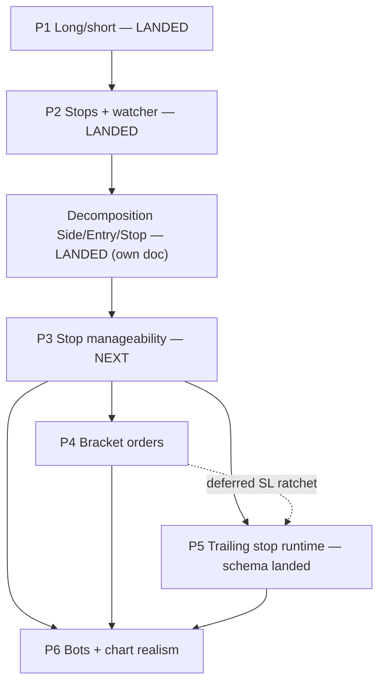

# Advanced Orders — Finalized Plan (§3.6)

## Context

`CLAUDE_NOTES.md` §3.6 wants long/short positions, stop-loss, and trailing-stop orders so the
chart shows two-sided resting flow and protective exits instead of pure market-print churn. A
draft sketched a four-patch path and asked Ultraplan to **finalize the forks, tighten the file
lists, and confirm the architecture**. This plan does that and adds a **design bug/risk register**
found by tracing the real settlement code on 2026-06-03 — several seams would silently reject or
mis-settle shorts/stops if implemented as the draft described.

**Scope this round (out: leverage/margin §3.6 D).** Long & short (cash-collateralized),
`StopMarket`, `StopLimit`, `TrailingStop`, bot integration.

**Status (2026-06-04).** Patches are numbered **P1–P6**, one per PR, in order — each landing where the
build (`dotnet build` at 0 warnings), the EF migration, and the property tests run.

| Patch | Status |
|---|---|
| **P1** Long/short (cash-collateralized) | **LANDED** — `143f33a`, `9ee845c` |
| **P2** Stop-loss / stop-limit + watcher | **LANDED** — `15a32fa`, `0fa30af`, `059b619`, `07dc6d5` |
| *Order-Type Decomposition* (`Side/Entry/Stop`) | **LANDED** — `737a3e4` (+ slippage-cap-on-stop `05cdb09`/`4d5ba05`/`58c200a`); see `ORDER_TYPE_DECOMPOSITION_PLAN.md` |
| **P3** Stop manageability (chart line + modify) | **← next to implement** |
| **P4** Bracket orders (entry + protective legs) | documented |
| **P5** Trailing stop (runtime; schema landed) | documented |
| **P6** Bots + chart realism | documented |

P3–P6 were drafted as `P2.5 / P2.6 / P3 / P4`; they have been flattened to the sequence above. The
decomposition is a **landed interlude** between P2 and P3 (it changed only the type *representation*) and
keeps its own doc rather than a patch number.

**Owner testing preference.** The owner prefers to **manually test in one pass after a patch is
implemented**, rather than soaking each sub-step in isolation. Automated property tests + 0-warning
builds still run per patch.

## Patch dependency & stop runtime shape



```
QuoteUpdated ─► StopTriggerWatcher (in-mem armed index per (stock,ccy))
                  │ cross? atomic remove-from-index (double-trigger guard)
                  ▼
            Order: Pending ─► active type, DB UPDATE (not insert), reservation already held
                  ▼
       OrderExecutionService.MatchAndSettleAsync  ◄─ shared body, SKIPS place-time reserve
                  (book → user gates → DB tx)
```

---

## Fork decisions (locked, with rationale)

> **LANDED (P1/P2).** The forks below are implemented; retained for rationale. The MVP narrowing and the
> risk register that follow were the P1/P2 design record — also shipped.

**D1 — Signed `Position.Quantity`** (one row per `(user,stock)`; `<0` = short). Chosen over a
Side-flag/second-row: every `GetPosition(user,stock)` consumer, `AccountsCache`,
`ReservationAuditor`, `ConservationProbe` stay single-lookup; long/short net economically;
**`ConservationProbe` already sums signed deltas — verified, no probe change.** Short risk lives
on the **Fund** (`ReservedBalance`), never on `Position.ReservedQuantity`.

**D2 — New `Order.Statuses.Pending`** for armed stops (not a separate table). Persists as a normal
`Orders` row, off-book, invisible to the matcher; the book-vs-user-cache split is small because
both feed queries already filter to limit types (audit list in P2).

**D6 — Short collateral lives at the POSITION level (`Position.ShortCollateral`, decimal), mirrored
into `Fund.ReservedBalance`** — *not* on the order. Rationale (the decisive one): collateral is
opened by the short sell but **released by a different order** (the buy-to-close), and it must
**outlive the opening order's fill** while the short position is open. Order-level tracking
(`Order.CurrentBuyReservation`) cannot express an obligation that survives its own order and is
discharged by another. Position-level also matches what `ReservationAuditor` already iterates: its
Fund expectation becomes `Σ(open-buy order reservations) + Σ(position ShortCollateral)`; and
`AccountsCache` backfills collateral from **short positions**, not orders.

**MVP narrowing for P1 (de-risks the highest-blast-radius patch):** open shorts **only via
immediate-fill (market) sells**; **defer resting short LIMIT sells** to a P1-follow-up. This
collapses the otherwise two-phase order→position collateral transfer into a single same-tick step
(reserve at place → position goes short on the same fill), and removes the resting-short
cancel/clamp paths entirely from the MVP (risks #5 and the canceller half of #3 disappear for P1).
Bots short via market sells (P4), so chart realism is unaffected.

---

## ⚠ Design bug / risk register (P1/P2 — LANDED)

> **LANDED.** These were the concrete failure points found while tracing settlement; each was fixed in
> P1/P2. Retained as the record of why the short/stop seams are shaped the way they are.

These are concrete failure points found in the current settlement code. Each P1 step below maps
to one.

1. **Seller fill path is long-only and throws on shorts.**
   `TradeSettler.SettleNoTxAsync` (`Settlement/TradeSettler.cs:~330`) always calls
   `sellerPos.ConsumeReservedStock(t.Quantity)`, which requires `ReservedQuantity >= qty` and does
   `Quantity -= qty` — a short seller has neither reserved nor owned shares, so it throws/operation-
   fails. **Fix:** branch — when the sell opens/extends a short (collateral-backed, not share-
   reserved), apply a signed `Position.ApplyDelta(-qty)` and **do not** touch `ReservedQuantity`;
   release the matching share-reservation logic only for the long portion.

2. **`SellerCapacityValidator` rejects every short fill.**
   (`Settlement/SellerCapacityValidator.cs`) accepts a fill only when
   `orderReservation + AvailableQuantity >= qty`; a short has 0/insufficient of both → the fill
   becomes a `RejectedFill` and the maker is auto-cancelled. **Fix:** treat a collateral-backed
   short-opening sell as capacity-valid (the cash collateral, not shares, is the backing); thread
   an "is short-opening" signal (from the order) into the validator.

3. **Sell paths take only the position gate, but shorts mutate the Fund.** `OrderSettler.SettleAsync`
   (sell branch → `AcquirePositionGateAsync`, returns `InsufficientStocks` when `AvailableQuantity <
   Quantity`) **and** `OrderCanceller.CancelAsync` (sell → position gate) both touch only the position
   gate; a short reserves/releases **cash on the Fund**. **Fix:** for short-opening sells, acquire
   **both** gates in one fixed global order (position-then-fund everywhere, to avoid AB/BA deadlock —
   the codebase already sorts gate keys in `TradeSettler`), `Fund.ReserveFunds(S × P_anchor)`, with
   symmetric rollback in the existing catch (which today releases only share OR buy-fund reservations).
   *Under the P1 MVP (immediate-fill shorts only) there is no resting short to cancel, so the canceller
   change is P1-follow-up; the settler dual-gate is required in P1.*

4. **Stop promotion would double-reserve and double-insert.**
   `OrderExecutionService.PlaceAndMatchAsync` opens with `_settlement.SettleOrderAsync` which
   **reserves at place time and `CreateOrder` (INSERT)**. An armed stop already holds its
   reservation and already exists in the DB, so promoting it by re-calling `PlaceAndMatchAsync`
   reserves twice and inserts a duplicate. **Fix (P2):** extract the post-reserve body of
   `PlaceAndMatchAsync` (everything from `WithBookLockAsync` onward) into a shared
   `MatchAndSettleAsync(incoming, ct)`. Normal placement = `SettleOrderAsync` → `MatchAndSettleAsync`.
   Promotion = flip `Pending`→active type + `UpdateOrder` + `MatchAndSettleAsync` (no reserve, no
   insert). Releasing-then-replacing the reservation is rejected: a competing order could grab the
   freed funds and the protective stop would fail to fire.

5. **`AccountsCache` backfill ignores short collateral and would cancel under-backed sells.**
   The backfill clears `Fund.ReservedBalance` and rebuilds it from open **orders** only
   (`GroupOpenOrdersBySide`); short collateral lives on the **position** (D6), so on every restart the
   short's collateral would vanish from `ReservedBalance`. Separately `ClampSellsToPositionQuantity`
   (`AccountsCache.cs:174`) cancels any open sell whose reservation exceeds `Position.Quantity`.
   **Fix (P1):** after the order-driven rebuild, add `Position.ShortCollateral` of every short position
   back into `Fund.ReservedBalance` so hydration reproduces collateral. *The clamp-cancel case only
   bites resting short sells, which the P1 MVP excludes — clamp change is P1-follow-up.*

6. **Market short has no anchor price for collateral.**
   A `TrueMarketSell` opening a short has `Price = 0`, but collateral `S × P_anchor` needs a live
   price. **Fix:** populate the anchor from `_data.Quotes`/`GetLastPriceAsync` (the exact pattern
   `OrderEntryService.PlaceOrderAsync` already uses for SlippageMarket anchors), with a small
   over-reserve buffer; reconcile to the actual fill at settle time.

7. **Mixed close-long-and-open-short in one order spans the settlement boundary.**
   A user long 100 selling 150 would consume 100 reserved shares **and** open a 50 short in a single
   order/fill — two different reservation models straddling one fill. **Decision for P1: disallow
   mixed** — reject a sell that both closes a long and opens a short (`OrderValidator`: a short-
   opening sell requires `AvailableQuantity == 0`). Document the split-handling as a P1-follow-up so
   the MVP stays correct and minimal. The bots (P4) place pure opens/closes, so realism is unaffected.

8. **`ReservationAuditor` would flag short collateral as a leak.** It reconciles `Fund.ReservedBalance`
   against `Σ(open-buy order reservations)` only. **Fix:** change the Fund expectation to
   `Σ(open buys) + Σ(position ShortCollateral)`, so collateral is accounted, not flagged. Required
   before P4 or every short reads as phantom reserved cash.

---

## Patch 1 — Long/short positions (cash-collateralized)   *(LANDED — `143f33a`, `9ee845c`)*

**Outcome:** a **market** sell with no inventory opens a cash-collateralized short (resting short
LIMIT sells deferred per the D6 MVP narrowing); buy-to-close nets correctly; no leverage;
`ConservationProbe`/`ReservationAuditor` stay green; a restart mid-short rehydrates collateral.

### Collateral sequence (conservation-preserving; position-level per D6)
Market short-opening sell of `S` at anchor `P_anchor`, fill `P_fill`; later buy-to-close of `S` at `P_close`.
- **Place (risk #3,#6):** under position+fund gates, `Fund.ReserveFunds(S × P_anchor)` and stage the
  collateral for the about-to-open short. (Immediate-fill only in P1, so place and fill are one tick.)
- **Fill-open (risk #1,#2):** `Position.ApplyDelta(-S)` (no `ReservedQuantity` touch);
  `Position.ShortCollateral += S × P_anchor`. Seller credited `TotalBalance += S × P_fill` like any
  seller. Buyer `+S` shares / `−S×P_fill` cash → net cash 0, net signed share 0 ⇒ probe green.
- **Buy-to-close:** ordinary buy path — `buyerFund.ConsumeReservedFunds(S×P_close)`,
  `Position.ApplyDelta(+S)` toward 0; then release proportional collateral
  `c = ShortCollateral × (S / |QuantityBefore|)`: `Fund.UnreserveFunds(c)`, `Position.ShortCollateral -= c`.
  Reserve/unreserve move only `ReservedBalance`, never `TotalBalance`, so collateral is invisible to the
  probe; realized P/L `= S×(P_fill − P_close)` already sits in `TotalBalance`. Clamp the close at
  `|Quantity|` so a buy can't over-cover a short.

### Model / domain
- `Position.cs`: `IsValid()` — drop `Quantity >= 0` and `AvailableQuantity >= 0`; **keep
  `ReservedQuantity >= 0`**; add `ShortCollateral >= 0` and `ShortCollateral == 0 when Quantity >= 0`.
  Add `ApplyDelta(int signedQty)` + `ShortCollateral` field with take/release helpers; **leave the
  existing long-only mutators untouched**.
- `Fund.cs`: no new field (reuse `ReserveFunds`/`UnreserveFunds`/`ReservedBalance`).
- `Order.cs`: no new type — a short is a (market) sell whose seller lacks inventory; engine infers
  from available long qty.

### Engine (each maps to the register)
- `OrderValidator` — allow `quantity > AvailableQuantity` for a sell only when (a) it is a **market**
  sell (P1 MVP), (b) `AvailableQuantity == 0` (no mixed close+open, risk #7), and (c) collateral
  `S × P_anchor` is postable; `NotionalOverflows`-style guard on the collateral multiply. (Holdings-
  aware checks live in `OrderSettler`, which has `_accounts`; the validator stays structural.)
- `OrderSettler.SettleAsync` — short branch: dual gate (position+fund, fixed order), `ReserveFunds`
  collateral + stage `ShortCollateral`, symmetric rollback (risk #3). Anchor from live quote (risk #6).
- `SellerCapacityValidator.Filter` — accept collateral-backed short-opening sells (risk #2).
- `TradeSettler` — seller short branch: signed `ApplyDelta(-qty)` + `ShortCollateral +=`, skip
  `ConsumeReservedStock` (risk #1); buy-to-close proportional collateral release (risk #1 close half).
- `ReservationMath` — add `InitialShortCollateral(order)` (mirror of `InitialBuyReservation`).
- `ReservationAuditor` — Fund expectation `+= Σ ShortCollateral` (risk #8).
- `AccountsCache` — backfill `ReservedBalance += Σ Position.ShortCollateral` after the order rebuild
  (risk #5).
- `ConservationProbe` — **no change**; add a property test asserting green with negative positions.

### Persistence + migration
- `PositionRow`/mapper: `Quantity` column already signed `integer` (re-confirm negatives round-trip);
  **add `ShortCollateral` money column** + mapper both directions + `KseDbContext` `Property`
  (`HasColumnType(Money)`). Also update the hand-written Dapper column lists / INSERT / UPDATE in
  `PgDBService.Portfolio.cs`.
- `KseDbContext.cs:109-111`: replace `CK_Positions_Quantity_Invariants` with
  `"ReservedQuantity" >= 0 AND "ReservedQuantity" <= GREATEST("Quantity", 0) AND "ShortCollateral" >= 0
  AND ("Quantity" >= 0 OR "ReservedQuantity" = 0)`.
- `dotnet ef migrations add ShortPositions` (against `KseDbContextFactory`).

### Wire + UI
- Placed via the existing **market**-sell path — no new DTO/endpoint. `PlaceOrderViewModel.ValidateInputs`
  validates collateral instead of share availability when a market sell exceeds holdings; surface
  available collateral + a "Short" affordance using shared styles. `UserPositionsView`/portfolio
  render negative qty as red `SHORT N` and show `ShortCollateral`.

### Verification (P1) — must run where the toolchain exists
- New `KieshStockExchange.Tests` property test: randomized buy/sell/short/close conserve cash +
  shares; no negative `TotalBalance`; reservation ledger nets to zero; a short can't close for more
  than opened; **restart mid-short → AccountsCache hydration does not cancel the short** (risk #5).
- Build client + server at **0 warnings**.
- Manual: open short on zero-holding stock → collateral reserved; buy-to-close → P/L + collateral
  release; `ConservationProbe` + `ReservationAuditor` soak clean.

---

## Patch 2 — Stop-loss (`StopMarket`+`StopLimit`) + watcher   *(LANDED — `15a32fa`, `0fa30af`, `059b619`, `07dc6d5`)*

> **Reconciled to shipped model.** This section was written against the old flat `OrderType` + setter
> whitelist; the **decomposition (`737a3e4`) superseded that mechanism**. A stop is now `Stop=Stop` with
> `Entry=Market|Limit` on the `Side/Entry/Stop` dimensions — no `Types` constant or setter whitelist to
> extend. `Pending` status stayed. The `IsStopOrder`/`IsStopLimitOrder`/`IsArmed`/display helpers were
> re-expressed on the enums (see `Order.cs`). The notes below are kept for the watcher/reservation design.

- `Order.cs`: `StopPrice` added; the stop *type* is the `Stop=Stop` dimension (not a `Types` whitelist
  entry); `Pending` added to `Statuses`. **Buy-stops carry `BuyBudget`** (true-market semantics) — else
  `ReservationMath.ReservationPerUnit` returns 0 and the `AccountsCache` backfill reserves nothing.
- `OrderValidator`: sell-stop `StopPrice ≤` mkt, buy-stop `≥` mkt; `StopLimit` needs `StopPrice`+`Price`,
  `StopMarket` has `Price=0`. Reserve at **arm time** (sell-stop→shares; buy-stop-closing-short→collateral).
- `StopTriggerWatcher : IHostedService` (D3): subscribes `IMarketDataService.QuoteUpdated`
  (`MarketDataService.cs:33`), in-mem armed index per `(stock,ccy)`, **atomic remove-before-promote**,
  promotes via the shared **`MatchAndSettleAsync`** (risk #4) after flip + `UpdateOrder`. Cold-load from
  `Status='Pending'`.
- `OrderEntryService`/`IOrderEntryService`/`OrderController /place`/`ApiOrderEntryClient`: four
  `PlaceStop*` entry points that persist `Pending` + register, not `PlaceAndMatch`. Cancel-while-armed
  releases reservation + de-indexes.

**D2 consumer-audit (exact phantom-book surface):**
- Leave **limit-only** (book must not see Pending): `GetOpenLimitOrders` (`PgDBService.Orders.cs:140`)
  → `OrderBookEngine.EnsureLoadedAsync:89`.
- **Include Pending** (user panel / reservation / bots): `GetOpenOrdersForUsersAsync`
  (`PgDBService.Orders.cs`) — post-decomposition the limit predicate is `"Entry"='Limit' AND "Stop"='None'`;
  the query includes armed stops (`Status='Pending'`). Consumed by `AccountsCache` + `AiBotStateService`.
- New cold-load `GetAllArmedStopsAsync` (`WHERE Status='Pending'`).
- Retention §8.7: never-prune extends to `Pending` and positions backing a short/armed stop
  (`Services/RetentionServices/`).
- Persistence: `OrderRow`+`OrderMapper` gain `StopPrice`; `KseDbContext` Property; migration `StopOrders`.
- UI: type selector gains Stop/Stop-Limit + `StopPrice` input; `OpenOrdersView` renders/cancels Pending.

---

## Decomposition — `Side / Entry / Stop` (landed interlude)   *(LANDED — `737a3e4`)*

Between P2 and P3 the flat `OrderType` string was decomposed into three orthogonal dimensions
(`OrderSide`, `EntryType`, `StopKind`) — **type representation only; settlement, reservation, and matching
are unchanged.** `Order.OrderType` is now a *computed read-only* projection back to the legacy 10 strings
(for logs/telemetry); the `IsX`/display helpers are re-expressed on the enums; the `Types` setter
whitelist is gone. Slippage became a **cap on a Market entry** (not a type), which yields slippage-capped
stops for free (`05cdb09`/`4d5ba05`/`58c200a`). `StopKind.Trailing` + the `TrailOffset/TrailIsPercent/
TrailWatermark` columns landed here too (schema only; **runtime is P5**). Full detail:
`ORDER_TYPE_DECOMPOSITION_PLAN.md`. Every patch below assumes this model.

---

## Patch 3 — Stop manageability (chart stop line + modify an armed stop)   ← next to implement

**Goal:** (1) draw an armed stop's trigger as a dashed line on the chart; (2) let the user modify an armed
stop's `StopPrice` (+ stop-limit limit price, + quantity) from the panel and by chart-drag, re-indexing the
watcher and keeping reservations consistent. **Cancel-while-armed already works.** P4 (bracket) and P5
(trailing) both reuse the chart stop line + the stop-modify path.

**Enabler already in place (verified):** `OrderCacheService.cs:54` puts armed stops in `OpenOrders`
(`if (o.IsOpen || o.IsArmed) open.Add(o)`), so the chart and open-orders panel already receive them — the
chart just *skips* them today.

### A. Chart stop line (render)
- `KieshStockExchange/Services/MarketDataServices/Helpers/ChartTypes.cs:56` — `OpenOrderLine` record gains
  a flag: `OpenOrderLine(int OrderId, decimal Price, bool IsBuy, int Quantity, bool IsStop = false)`. The
  default keeps existing call sites compiling.
- `KieshStockExchange/ViewModels/TradeViewModels/ChartViewModel.cs:213-229` `SyncOpenOrderLines` — change
  `if (o.IsMarketOrder || o.IsStopOrder) continue;` to skip **market only**, then add a stop branch:
  `if (o.IsStopOrder) { if (o.StopPrice is decimal sp && sp > 0m) OpenOrderLines.Add(new OpenOrderLine(o.OrderId, sp, o.IsBuyOrder, o.Quantity, IsStop: true)); continue; }`
  Keep the existing limit branch emitting `IsStop: false`.
- `KieshStockExchange/Services/MarketDataServices/Helpers/CandleChartDrawable.cs:264 DrawOpenOrderLines` —
  when `line.IsStop`, paint a distinct dash (e.g. `{2,3}`) and an inline `STOP`/`STOP-LIM` pill instead of
  the `B/S {qty}` tag. Add an `OpenOrderStopColor` field near `:71` (default a muted amber), set by
  `ChartView` from the palette — or reuse the side colour with the distinct dash. `HitOpenOrderLine`
  (`:369`) is already price-based, so stop lines become hit-testable for drag with no change there.

### B. Modify an armed stop — engine + settlement
- **Validator** `Server/Services/MarketEngineServices/Helpers/OrderValidator.cs` — add
  `ValidateModifyStop(Order, int? newQty, decimal? newStopPrice, decimal? newLimitPrice)` (declare on
  `IOrderValidator`): require `order.IsArmed && order.IsStopOrder`; `newStopPrice` (if set) `> 0`;
  stop-limit `newLimitPrice` (if set) `> 0`; `newQty` (if set) `> 0` and `<= MaxOrderQuantity`;
  `NotionalOverflows` guard on a buy-stop-limit's `qty × limitPrice`. Leave the existing `ValidateModify`
  (`:204`, limit-only, rejects non-Open) untouched.
- **New settlement path** — add `Task ApplyStopChangeAsync(Order order, int? newQty, decimal? newStopPrice,
  decimal? newLimitPrice, CancellationToken ct)` to `ISettlementEngine.cs` + `SettlementEngine.cs`,
  delegating to a **new `internal sealed class StopModifier`** modeled on `Settlement/OrderModifier.cs`
  (register it in `SettlementEngine`'s ctor + DI like `OrderModifier`). It mirrors
  `OrderModifier.ApplyChangeAsync` **minus the book**:
  - gate: `order.IsBuyOrder ? AcquireFundGateAsync : AcquirePositionGateAsync` (`OrderModifier.cs:36-38`);
  - mutate the **armed** order with raw setters (legal while `Pending`, `AmountFilled==0`):
    `order.StopPrice = newStopPrice ?? order.StopPrice`; stop-limit → `order.Price = newLimitPrice ?? order.Price`;
    `order.Quantity = newQty ?? order.Quantity`. **Do not** call `UpdatePrice/UpdateQuantity` — those throw
    for non-limit/non-open (`Order.cs:392-411`);
  - **reservation delta only when it changes** (gate held, in the tx; mirror the `OrderModifier`
    sell/buy branches at `:109-158`, incl. ledger + rollback):
    - **sell-stop** (shares): delta `= newQty − oldQty` on `Position` + `order.{Take,Consume}SellReservation`;
      `StopPrice`/limit changes have **no** share effect;
    - **buy-stop-market** (flat budget): budget not modifiable → qty/stop changes have **no** cash effect
      (consistent with `ReservationMath`'s true-market comment `:56`);
    - **buy-stop-limit** (cash = qty × limit): delta `= ProjectedBuyReservation(new) − order.CurrentBuyReservation`
      on `Fund` + `order.{Take,Consume}BuyReservation`.
      ⚠ **GOTCHA:** `ReservationMath.ProjectedBuyReservation` (`ReservationMath.cs:53-70`) returns **0** for
      an armed buy-stop-limit because `IsLimitOrder` is false while `Stop != None`. Fix it with a one-liner
      that matches how `ReservationPerUnit`/`InitialBuyReservation` already special-case `StopLimitBuy`
      (`:21`): `if (o.IsLimitOrder || o.OrderType == Order.Types.StopLimitBuy) perUnit = newPrice ?? o.Price;`
  - persist via `_db.UpdateOrder` inside the tx; **no `book.*` calls**.
- **Engine** `OrderExecutionService.cs` — add `Task<OrderResult> ModifyStopAsync(int orderId, int? newQty,
  decimal? newStopPrice, decimal? newLimitPrice, CancellationToken ct)` to `IOrderExecutionService.cs` +
  impl: load (`_db.GetOrderById`), resolve canonical (`_registry.TryGet`, cf. `:336`/`:296`), assert
  `IsArmed && IsStopOrder`, `_validator.ValidateModifyStop(...)`, `await _settlement.ApplyStopChangeAsync(...)`,
  `_orderCache.NotifyOrdersMutated(new[]{order.UserId})`, return
  `OrderResultFactory.Modified(order, new List<Transaction>())`. **No book lock.** Implement the same
  method in the client proxy `ApiOrderExecutionService.cs` as `throw new NotSupportedException(...)`,
  mirroring `ArmStopAsync`/`PromoteStopAsync` (`:55-59`).
- **Entry service** `OrderEntryService.cs` — add `ModifyStopAsync(int userId, int orderId, int? newQty,
  decimal? newStopPrice, decimal? newLimitPrice, CancellationToken ct)` to `IOrderEntryService.cs` + impl:
  `VerifyOwnershipAsync` (`:61`); **direction sanity** against the live price, reusing the block at
  `:134-147` (buy-stop ≥ market, sell-stop ≤ market) for `newStopPrice`; `await _engine.ModifyStopAsync(...)`;
  **on success re-index the watcher** —
  `var updated = await _db.GetOrderById(orderId, ct); _stopWatcher.Disarm(orderId); if (updated is { IsArmed: true }) _stopWatcher.Arm(updated);`
  (`IStopWatcher.Disarm`/`Arm`, `StopTriggerWatcher.cs:55-68` — re-arming refreshes the cached
  `StopPrice`/`IsBuy` snapshot).

### C. Wire (DTO + controller + client)
- `Shared/Services/MarketEngineServices/CommandDtos/OrderRequests.cs` — add
  `public sealed record ModifyStopRequest(int UserId, int? Quantity, decimal? StopPrice, decimal? LimitPrice);`
  (leave `ModifyOrderRequest` for limit modifies untouched).
- `Server/Controllers/OrderController.cs` — add `[HttpPost("{id:int}/modify-stop")]` mirroring `Modify`
  (`:160-167`): caller / `UserId` check, then
  `_entry.ModifyStopAsync(caller, id, req.Quantity, req.StopPrice, req.LimitPrice, ct)`.
- `Client/Services/MarketEngineServices/ApiOrderEntryClient.cs` — add `ModifyStopAsync` posting to
  `api/orders/{id}/modify-stop` (mirror `ModifyOrderAsync` at `:69-77`).

### D. UI (panel + chart drag)
- `KieshStockExchange/ViewModels/TradeViewModels/ModifyOrderViewModel.cs` — add stop awareness:
  `IsStopOrder`/`IsStopLimit` flags off `TargetOrder`; in `Initialize` (`:119`) seed the price field from
  `order.StopPrice` (relabelled "Stop price") when `IsStopOrder`, and expose a second `LimitPriceString`
  only for a stop-limit; `ValidateInputs`/`ConfirmAsync` (`:134-209`) route to `_orders.ModifyStopAsync(...)`
  for stops vs `ModifyOrderAsync` for limits. Quantity edit stays.
- `KieshStockExchange/Views/TradePageViews/ModifyOrderView.xaml` — bind the "Limit price" label (`:61`) to a
  `PriceFieldLabel` ("Stop price" for a stop) and add a second limit-price `Entry` gated on `IsStopLimit`
  (shared styles).
- Chart drag-to-modify already routes through `ChartViewModel.BeginModifyOrderAtAsync` (`:404`), which only
  early-returns on `IsMarketOrder` — an armed stop passes (`Stop=Stop`, not market). The stop line is drawn
  at `StopPrice` (A), so the dragged value is the new `StopPrice`; the panel's stop branch interprets the
  prefill as `StopPrice`. No change needed in `BeginModifyOrderAtAsync`/`UpdateModifyPrice` beyond the VM branch.

### E. Already working — state, don't re-implement
- Armed stops listed + cancellable in `OpenOrdersView` (cache `OpenOrders` includes `IsArmed`).
- Cancel-while-armed releases the arm reservation + de-arms: `OrderEntryService.CancelOrderAsync` (`:40-48`)
  → `_stopWatcher.Disarm`; `OrderCanceller.cs:56-77` routes an armed cancel through the reservation-release
  path. Verified.

### Verification (P3)
- Modify an armed stop's trigger (panel + drag) → it re-arms and fires at the **new** level; cancel still
  releases; the chart line tracks the stop; a restart re-arms at the modified `StopPrice` (cold-load
  `GetAllArmedStopsAsync`). `ConservationProbe` + `ReservationAuditor` clean across a modify→trigger→fill
  and a modify→cancel. Build client + server at **0 warnings**.

---

## Patch 4 — Bracket orders (entry + attached protective legs)   *(after P3, before P5)*

**Why & shape.** Our stops today are **standalone** ("Buy+Stop" = a buy-stop *entry*, not a stop
attached to a buy). The standard active-trader model (researched 2026-06-04: IBKR, TradingView,
Kraken, TT, Alpaca, Phemex, CQG; multi-TP scale-out: eazypips/onetradingmarkets/TradingView trade
managers) is a **bracket**: a parent entry carries a protective **stop-loss** plus **up to three
scale-out take-profits**, all armed automatically once the parent fills, sized to whatever filled,
with the protective legs in **OCO** (a fill on one reduces/cancels the others). This is the owner's
natural mental model. **Full bracket (one stop-loss + up to three take-profits, group-OCO) is in
scope for this patch.**

**Not a new flat type.** The UI may present a **Market / Limit / Trigger** choice, but "Trigger" maps
to the existing decomposed `Stop != None` dimension (`Side`/`Entry`/`Stop`) — *do not* reintroduce a
flat `Market/Limit/Trigger` enum (a trigger is itself a stop-market or stop-limit once it fires). The
genuinely new primitive is the **parent→child link + dormant child + fill-driven sizing**, not a type.

### Locked decisions
- **A1 — every leg tracks the parent fill (industry standard).** Each partial fill of the parent grows
  the SL **and each enabled TP** by the filled amount (TPs by their *allocated share* of the fill — see
  allocation), as a **single order each** (resize, not new orders). The SL always covers the full
  filled qty; the TPs cover their slices.
- **Allocation — per-TP qty, default equal, partial coverage OK.** Up to three TPs; the user sets a
  quantity per enabled TP (UI prefills an equal split of the parent qty). **TPs need not sum to the
  full position** — the SL always covers the *entire remaining* open quantity; any qty not assigned to
  a TP simply rides the SL. Validate: Σ TP qty ≤ parent qty; each TP on the profit side of the entry;
  TP prices strictly ordered away from entry (long: TP1<TP2<TP3, all above entry; short: mirror).
- **B1 — group-OCO reduce-then-cancel.** The TPs are independent of each other (hit in sequence), but
  the **single SL is in OCO with the whole TP group**: any TP fill **reduces the SL by the executed
  qty**; an SL fire **cancels all open TPs** + de-indexes. "Σ open TP qty (≤ their slices) + SL qty"
  always equals the held quantity.
- **SL ratchet — DEFERRED to P5/later.** P4 ships scale-out + a **static-price** SL (resized down per
  B1, but its trigger *price* does not move). Auto-moving the SL to breakeven/prior-TP as TPs fill
  overlaps trailing-stop logic and lands after P5.
- **Cancel-the-remainder.** If a protective leg triggers/fills while a **limit parent** still has an
  unfilled remainder resting, **cancel that remainder** (you stop acquiring a position you're exiting).
- **Cancel semantics.** Cancel an *unfilled* parent → discard the dormant children. Cancel a
  *partially-filled* parent → **leave the armed children** protecting the shares already acquired.
- **Slot:** after P3 (reuses its chart line + stop-modify), before P5 (trailing is independent; a
  trailing child + the SL ratchet are later niceties once P5 lands).

### Lifecycle (long example: buy 10, TP1 $660 / TP2 $670 / TP3 $685 ×~3-4 each, SL $640)
1. **Place parent + children.** Persist parent normally; persist each enabled TP (limit) and the SL
   (stop) as children in a new **dormant `Attached` status** — `ParentOrderId` set, **reserve nothing,
   not on the book, not in the watcher**.
2. **Parent fills `q`.** Arm/resize all children to the cumulative fill: SL → a `Pending` stop at $640
   covering the full filled qty; each TP → a resting `Open` **limit** on the book at its price, sized
   to its allocated slice of the fill.
3. **Parent fully fills.** SL covers 10; TP slices sum to ≤ 10 (uncovered remainder rides the SL).
4. **Group-OCO (B1).** Price hits $660 → TP1 fills (book), `ArmOrResize` **reduces the SL** by TP1's
   qty; TP2/TP3 keep working. SL fires → **cancel all open TPs** + de-index. Each TP fill shrinks the SL.
5. Direction auto-derived: long parent → **SL sell below**, **TPs sell above**; short parent (sell
   entry) → **SL buy above (cover)**, **TPs buy below**. Validate each leg is on the correct side of
   the entry price and the TPs are strictly ordered away from it.

### Reservation model (the subtle part)
The protective legs are **alternatives, not additive** — for a 10-long bracket you hold 10 shares, not
40. **The whole leg group shares ONE reservation** of the protected quantity, sized to filled parent
qty; the SL holds it and each TP draws its slice from it. A fill on any leg consumes from the shared
pool and shrinks the SL (B1), so the legs combined never exceed the held position. Arming happens
*after* the parent fill, so the shares (long bracket) / cash collateral (short bracket buy-to-close)
already exist — no place-time double-reserve. This reuses P2's "reserve at arm time" path; the new
work is the **shared/joint** pool across the leg group rather than one reservation per order.

### Where it lives (layer map)
- **Model** (`Order.cs`): add `ParentOrderId int?`; add a dormant **`Attached`** status to `Statuses`;
  helpers `IsBracketChild`/`IsAttached`; child `Side` derived opposite the parent. `IsClosed` stays
  terminal-only so dormant/armed children are never pruned (retention §8.7 extends to `Attached`).
- **Persistence/DB**: `OrderRow`+`OrderMapper` gain `ParentOrderId`; `KseDbContext` property + the
  `Attached` vocabulary; migration `BracketOrders` (add nullable `ParentOrderId` column). Cold-load:
  `Attached` children rehydrate dormant (NOT armed); already-armed legs rehydrate via the P2 path.
- **Engine** (`OrderExecutionService`): a fill hook in the settlement path (`OrderSettler`/
  `TradeSettler`, after a fill commits) → new `ArmOrResizeChildrenAsync(parent)` that arms-or-resizes
  the SL + every enabled TP to cumulative filled qty (A1, TPs by their slice) and reuses `ArmStopAsync`
  for the SL leg. A second hook on a *child* fill runs group-OCO (B1): a TP fill shrinks the SL; an SL
  fire cancels all open TPs; + (limit parent) cancel parent remainder. Watcher unchanged — legs enter
  its index only when armed.
- **API/DTO** (`PlaceOrderRequest` + controller + `ApiOrderEntryClient`): parent request gains an
  optional **bracket spec** — a **list of up to 3 TP legs** (`{ Price, Qty }`) and the SL fields
  (`StopKind`+`StopPrice`+optional limit/slippage for a stop-limit child). Absent = a plain order
  (back-compat). Validate the list ≤ 3, Σ Qty ≤ parent qty, prices ordered/on the correct side.
- **Client** (`PlaceOrderViewModel` + `PlaceOrderView.xaml`): the ticket gains an SL price field and
  **up to three TP rows** (add/remove a TP, each a price + qty, qty prefilled to an equal split),
  shared styles. **Wrap the panel body in a `ScrollView`** — the ticket (side, type, stop, qty,
  slippage, SL + 3 TP rows) now exceeds the panel height; the `Border` keeps its frame and a
  `ScrollView` hosts the `VerticalStackLayout` so the content scrolls within a constrained panel
  height (the `TradePage` parent must give the panel a bounded height or the ScrollView won't scroll).
  Chart + `OpenOrdersView` already render stops (P3) and resting limits (notes 4.10) — every leg
  shows through the existing paths once armed; cancelling the parent or any leg flows through the same
  cancel UI.

### Verification (P4)
- Property test: place a bracket (1–3 TPs), drive partial parent fills → SL + every TP resize to
  cumulative fill/slice (A1); fill TPs in sequence → each shrinks the SL (B1); SL fire → all open TPs
  cancel; shared reservation never exceeds held qty; partial TP coverage leaves the remainder on the
  SL; cancel-unfilled-parent discards children, cancel-partial-parent keeps them.
- Manual: market-buy bracket with 3 TPs (instant fill → all legs armed) and limit-buy bracket (slow
  fill → legs grow); scale out through TP1/TP2/TP3; trigger the SL; `ConservationProbe` +
  `ReservationAuditor` clean throughout.
- Build client + server at **0 warnings**.

---

## Patch 5 — Trailing stop (runtime)   *(documented; later PR — schema landed)*

**Schema already shipped** by the decomposition (`737a3e4`): `StopKind.Trailing` (`Order.cs:8`) and the
`TrailOffset`/`TrailIsPercent`/`TrailWatermark` columns (`Order.cs:142-154`) + `OrderRow`/mapper/
`KseDbContext` mapping all exist. **P5 is runtime-only** — no new type constant, no migration:
- `StopTriggerWatcher.OnQuoteUpdated` (`:111-131`): add a trailing branch — each quote ratchets
  `TrailWatermark` monotonically in the favorable direction (never retreats), recomputes the effective
  trigger from the offset (abs or `%`), and fires via the same atomic remove-before-promote. Persist the
  watermark as it moves so a restart resumes from the ratcheted level (cold-load already pulls
  `Status='Pending'`).
- `OrderValidator`: positive offset, sane percent band, direction sanity.
- Entry points: `PlaceTrailingStopBuy/SellOrderAsync` on `IOrderEntryService`/`OrderEntryService`/
  `ApiOrderEntryClient`, and a `(StopKind.Trailing, …)` arm in `OrderController.Place`'s switch
  (`:124-147`, which currently has no Trailing case → returns `BadRequest`). `PlaceOrderRequest` already
  carries `Stop`; add `TrailOffset`/`TrailIsPercent` fields.
- UI: ticket Trailing option with an abs/% toggle. Chart line reuses the P3 stop-line path at the moving
  trigger level.

## Patch 6 — Bots + chart realism   *(documented; later PR)*
`AiBotDecisionService` gains a short-opening branch (sentiment-gated, sized to postable collateral
via `_accounts`) + probabilistic protective `StopMarket`/`TrailingStop` (seeded path stays
deterministic — bots place **pure** opens/closes, sidestepping risk #7). New `Bots:*` knobs
(`ShortProb`/`StopLossProb`/`TrailingStopProb`/`StopOffsetPrc`/`TrailOffsetPrc`).
`BotEconomyTelemetry` includes short exposure + collateral. Reconcile/ConservationProbe soak with
shorts+stops live is the acceptance gate.

---

## Adjacent: trade fill markers on the chart   *(owner-requested 2026-06-04; not an advanced-order patch)*

Render the user's own executed fills on the candle chart as small green (buy) / red (sell) dots at
`(fill time, fill price)` — the green/red "filled here" markers active-trader platforms show. It's a
**chart feature, not an order type**, but it reuses exactly the P3 chart-drawable infra (a new
`FillMarkers` list on `CandleChartDrawable` + a `DrawFillMarkers` pass that maps time→x / price→y like
`DrawOpenOrderLines` does), so it sits naturally on top of P3 once that lands. Sketch:
- **Data:** the user's `Transaction`s for the selected stock+currency within the visible viewport.
  The engine already publishes fills (`OnFillsAsync`/`OnTicksAsync`); the client needs the *user's own*
  fills — feed `ChartViewModel` from the per-user transaction history (filtered to the viewport) and
  append live ones as they arrive.
- **Drawable:** `FillMarker(DateTime AtTime, decimal Price, bool IsBuy)` list + a paint pass drawing a
  small filled circle (buy = bull colour, sell = bear colour); clip to the plot rect; skip off-viewport.
- **Scope/perf:** cap markers per viewport (cluster or thin when zoomed out) so a heavy fill history
  doesn't flood the canvas. Toggleable like the MA/open-order overlays.

Slot it whenever convenient after P3 — it has no dependency on P4/P5/P6 and no engine/DB change.

## Backlog — from P1 manual testing (future, owner-requested 2026-06-04)

- **Confirm/cancel popup dialogs.** The short-open / long→short-flip / marketable-limit warnings ship
  first as inline text, but should become proper modal popups (clear text + Confirm / Cancel buttons)
  so a risky order (opening a short, a limit that fills like a market) requires a deliberate confirm.
- **Per-stock P/L in the portfolio.** Today there's no way to see a closed trade's P/L (e.g. a
  buy-to-close). List every traded stock in the portfolio holdings with realized + unrealized P/L, as a
  single P/L column that can switch timeframe (daily / all-time). Mirrors how brokers show position P/L.

## Invariants every patch holds
- Lock order **book → per-user gates → DB tx** is sacrosanct; new dual-gate (short) acquisition uses
  one fixed global order; the watcher only promotes via the shared match path, never touches the book.
- Post-decomposition a new type is a new `(Side, Entry, Stop)` **combination**, not a new `Types`
  constant — resolved by the enum-based `IsX` helpers and the `OrderController.Place` dimension switch.
  When adding a combination, cover it in the `IsX` helpers, the controller switch, and the computed
  `OrderType` projection; there is no setter whitelist to extend.
- No leverage: collateral always fully posted; reject any short the user can't collateralize.
- Build stays **0 warnings**; manual run per CLAUDE.md.
