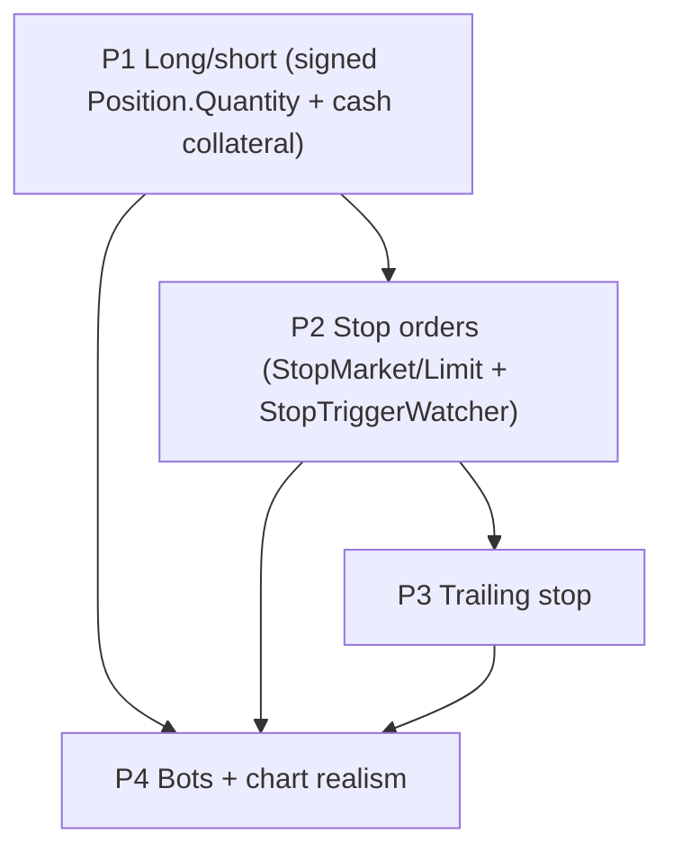

# Advanced Orders — Finalized Plan (§3.6)

## Context

`CLAUDE_NOTES.md` §3.6 wants long/short positions, stop-loss, and trailing-stop orders so the
chart shows two-sided resting flow and protective exits instead of pure market-print churn. A
draft sketched a four-patch path and asked Ultraplan to **finalize the forks, tighten the file
lists, and confirm the architecture**. This plan does that and adds a **design bug/risk register**
found by tracing the real settlement code on 2026-06-03 — several seams would silently reject or
mis-settle shorts/stops if implemented as the draft described.

**Scope this round (out: leverage/margin §3.6 D).** Long & short (cash-collateralized),
`StopMarket`, `StopLimit`, `TrailingStop`, bot integration.

**Handoff / sequencing.** Implement **one patch per PR**, in order, each landing where the build
(`dotnet build` at 0 warnings), the EF migration (`dotnet ef migrations add …`), and the property
tests can actually run. **Patch 1 (long/short positions) is the next unit to implement** — the
draft mandates "land P1 alone, soak it before stops" / "do not combine." P2–P4 stay documented
below for their own later PRs.

### Start here — Patch 1 implementation order (build incrementally)
Edit in this order so each step compiles before the next; full detail in the **Patch 1** section.
1. **Domain** — `Position.cs`: signed-`Quantity` `IsValid()`, `ApplyDelta`, `ShortCollateral` + helpers.
2. **Persistence** — `PositionRow`/`PositionMapper` + the Dapper column lists / INSERT / UPDATE in
   `PgDBService.Portfolio.cs`; then `KseDbContext` CHECK + `Property`; then `dotnet ef migrations add ShortPositions`.
3. **Reservation math** — `ReservationMath.InitialShortCollateral`.
4. **Place-time** — `OrderSettler.SettleAsync` short branch (dual gate, reserve, anchor, rollback).
5. **Fill-time** — `SellerCapacityValidator.Filter`, then `TradeSettler` seller-short + buy-to-close release.
6. **Reconcile/hydrate** — `ReservationAuditor` Fund expectation, `AccountsCache` collateral backfill.
7. **UI** — `PlaceOrderViewModel` collateral validation, `UserPositionsView` `SHORT N`.
8. **Verify** — property test + `dotnet build` (0 warnings) + manual short→close + auditor/probe soak.

Checkpoint after step 6: a market short opens, buy-to-close nets, and a restart rehydrates collateral
with `ConservationProbe`/`ReservationAuditor` clean — that's the gate before wiring UI.

## Patch dependency & stop runtime shape



```
QuoteUpdated ─► StopTriggerWatcher (in-mem armed index per (stock,ccy))
                  │ cross? atomic remove-from-index (double-trigger guard)
                  ▼
            Order: Pending ─► active type, DB UPDATE (not insert), reservation already held
                  ▼
       OrderExecutionService.MatchAndSettleAsync  ◄─ shared body, SKIPS place-time reserve
                  (book → user gates → DB tx)
```

---

## Fork decisions (locked, with rationale)

**D1 — Signed `Position.Quantity`** (one row per `(user,stock)`; `<0` = short). Chosen over a
Side-flag/second-row: every `GetPosition(user,stock)` consumer, `AccountsCache`,
`ReservationAuditor`, `ConservationProbe` stay single-lookup; long/short net economically;
**`ConservationProbe` already sums signed deltas — verified, no probe change.** Short risk lives
on the **Fund** (`ReservedBalance`), never on `Position.ReservedQuantity`.

**D2 — New `Order.Statuses.Pending`** for armed stops (not a separate table). Persists as a normal
`Orders` row, off-book, invisible to the matcher; the book-vs-user-cache split is small because
both feed queries already filter to limit types (audit list in P2).

**D6 — Short collateral lives at the POSITION level (`Position.ShortCollateral`, decimal), mirrored
into `Fund.ReservedBalance`** — *not* on the order. Rationale (the decisive one): collateral is
opened by the short sell but **released by a different order** (the buy-to-close), and it must
**outlive the opening order's fill** while the short position is open. Order-level tracking
(`Order.CurrentBuyReservation`) cannot express an obligation that survives its own order and is
discharged by another. Position-level also matches what `ReservationAuditor` already iterates: its
Fund expectation becomes `Σ(open-buy order reservations) + Σ(position ShortCollateral)`; and
`AccountsCache` backfills collateral from **short positions**, not orders.

**MVP narrowing for P1 (de-risks the highest-blast-radius patch):** open shorts **only via
immediate-fill (market) sells**; **defer resting short LIMIT sells** to a P1-follow-up. This
collapses the otherwise two-phase order→position collateral transfer into a single same-tick step
(reserve at place → position goes short on the same fill), and removes the resting-short
cancel/clamp paths entirely from the MVP (risks #5 and the canceller half of #3 disappear for P1).
Bots short via market sells (P4), so chart realism is unaffected.

---

## ⚠ Design bug / risk register (the reason for this revision)

These are concrete failure points found in the current settlement code. Each P1 step below maps
to one.

1. **Seller fill path is long-only and throws on shorts.**
   `TradeSettler.SettleNoTxAsync` (`Settlement/TradeSettler.cs:~330`) always calls
   `sellerPos.ConsumeReservedStock(t.Quantity)`, which requires `ReservedQuantity >= qty` and does
   `Quantity -= qty` — a short seller has neither reserved nor owned shares, so it throws/operation-
   fails. **Fix:** branch — when the sell opens/extends a short (collateral-backed, not share-
   reserved), apply a signed `Position.ApplyDelta(-qty)` and **do not** touch `ReservedQuantity`;
   release the matching share-reservation logic only for the long portion.

2. **`SellerCapacityValidator` rejects every short fill.**
   (`Settlement/SellerCapacityValidator.cs`) accepts a fill only when
   `orderReservation + AvailableQuantity >= qty`; a short has 0/insufficient of both → the fill
   becomes a `RejectedFill` and the maker is auto-cancelled. **Fix:** treat a collateral-backed
   short-opening sell as capacity-valid (the cash collateral, not shares, is the backing); thread
   an "is short-opening" signal (from the order) into the validator.

3. **Sell paths take only the position gate, but shorts mutate the Fund.** `OrderSettler.SettleAsync`
   (sell branch → `AcquirePositionGateAsync`, returns `InsufficientStocks` when `AvailableQuantity <
   Quantity`) **and** `OrderCanceller.CancelAsync` (sell → position gate) both touch only the position
   gate; a short reserves/releases **cash on the Fund**. **Fix:** for short-opening sells, acquire
   **both** gates in one fixed global order (position-then-fund everywhere, to avoid AB/BA deadlock —
   the codebase already sorts gate keys in `TradeSettler`), `Fund.ReserveFunds(S × P_anchor)`, with
   symmetric rollback in the existing catch (which today releases only share OR buy-fund reservations).
   *Under the P1 MVP (immediate-fill shorts only) there is no resting short to cancel, so the canceller
   change is P1-follow-up; the settler dual-gate is required in P1.*

4. **Stop promotion would double-reserve and double-insert.**
   `OrderExecutionService.PlaceAndMatchAsync` opens with `_settlement.SettleOrderAsync` which
   **reserves at place time and `CreateOrder` (INSERT)**. An armed stop already holds its
   reservation and already exists in the DB, so promoting it by re-calling `PlaceAndMatchAsync`
   reserves twice and inserts a duplicate. **Fix (P2):** extract the post-reserve body of
   `PlaceAndMatchAsync` (everything from `WithBookLockAsync` onward) into a shared
   `MatchAndSettleAsync(incoming, ct)`. Normal placement = `SettleOrderAsync` → `MatchAndSettleAsync`.
   Promotion = flip `Pending`→active type + `UpdateOrder` + `MatchAndSettleAsync` (no reserve, no
   insert). Releasing-then-replacing the reservation is rejected: a competing order could grab the
   freed funds and the protective stop would fail to fire.

5. **`AccountsCache` backfill ignores short collateral and would cancel under-backed sells.**
   The backfill clears `Fund.ReservedBalance` and rebuilds it from open **orders** only
   (`GroupOpenOrdersBySide`); short collateral lives on the **position** (D6), so on every restart the
   short's collateral would vanish from `ReservedBalance`. Separately `ClampSellsToPositionQuantity`
   (`AccountsCache.cs:174`) cancels any open sell whose reservation exceeds `Position.Quantity`.
   **Fix (P1):** after the order-driven rebuild, add `Position.ShortCollateral` of every short position
   back into `Fund.ReservedBalance` so hydration reproduces collateral. *The clamp-cancel case only
   bites resting short sells, which the P1 MVP excludes — clamp change is P1-follow-up.*

6. **Market short has no anchor price for collateral.**
   A `TrueMarketSell` opening a short has `Price = 0`, but collateral `S × P_anchor` needs a live
   price. **Fix:** populate the anchor from `_data.Quotes`/`GetLastPriceAsync` (the exact pattern
   `OrderEntryService.PlaceOrderAsync` already uses for SlippageMarket anchors), with a small
   over-reserve buffer; reconcile to the actual fill at settle time.

7. **Mixed close-long-and-open-short in one order spans the settlement boundary.**
   A user long 100 selling 150 would consume 100 reserved shares **and** open a 50 short in a single
   order/fill — two different reservation models straddling one fill. **Decision for P1: disallow
   mixed** — reject a sell that both closes a long and opens a short (`OrderValidator`: a short-
   opening sell requires `AvailableQuantity == 0`). Document the split-handling as a P1-follow-up so
   the MVP stays correct and minimal. The bots (P4) place pure opens/closes, so realism is unaffected.

8. **`ReservationAuditor` would flag short collateral as a leak.** It reconciles `Fund.ReservedBalance`
   against `Σ(open-buy order reservations)` only. **Fix:** change the Fund expectation to
   `Σ(open buys) + Σ(position ShortCollateral)`, so collateral is accounted, not flagged. Required
   before P4 or every short reads as phantom reserved cash.

---

## Patch 1 — Long/short positions (cash-collateralized)   ← next to implement

**Outcome:** a **market** sell with no inventory opens a cash-collateralized short (resting short
LIMIT sells deferred per the D6 MVP narrowing); buy-to-close nets correctly; no leverage;
`ConservationProbe`/`ReservationAuditor` stay green; a restart mid-short rehydrates collateral.

### Collateral sequence (conservation-preserving; position-level per D6)
Market short-opening sell of `S` at anchor `P_anchor`, fill `P_fill`; later buy-to-close of `S` at `P_close`.
- **Place (risk #3,#6):** under position+fund gates, `Fund.ReserveFunds(S × P_anchor)` and stage the
  collateral for the about-to-open short. (Immediate-fill only in P1, so place and fill are one tick.)
- **Fill-open (risk #1,#2):** `Position.ApplyDelta(-S)` (no `ReservedQuantity` touch);
  `Position.ShortCollateral += S × P_anchor`. Seller credited `TotalBalance += S × P_fill` like any
  seller. Buyer `+S` shares / `−S×P_fill` cash → net cash 0, net signed share 0 ⇒ probe green.
- **Buy-to-close:** ordinary buy path — `buyerFund.ConsumeReservedFunds(S×P_close)`,
  `Position.ApplyDelta(+S)` toward 0; then release proportional collateral
  `c = ShortCollateral × (S / |QuantityBefore|)`: `Fund.UnreserveFunds(c)`, `Position.ShortCollateral -= c`.
  Reserve/unreserve move only `ReservedBalance`, never `TotalBalance`, so collateral is invisible to the
  probe; realized P/L `= S×(P_fill − P_close)` already sits in `TotalBalance`. Clamp the close at
  `|Quantity|` so a buy can't over-cover a short.

### Model / domain
- `Position.cs`: `IsValid()` — drop `Quantity >= 0` and `AvailableQuantity >= 0`; **keep
  `ReservedQuantity >= 0`**; add `ShortCollateral >= 0` and `ShortCollateral == 0 when Quantity >= 0`.
  Add `ApplyDelta(int signedQty)` + `ShortCollateral` field with take/release helpers; **leave the
  existing long-only mutators untouched**.
- `Fund.cs`: no new field (reuse `ReserveFunds`/`UnreserveFunds`/`ReservedBalance`).
- `Order.cs`: no new type — a short is a (market) sell whose seller lacks inventory; engine infers
  from available long qty.

### Engine (each maps to the register)
- `OrderValidator` — allow `quantity > AvailableQuantity` for a sell only when (a) it is a **market**
  sell (P1 MVP), (b) `AvailableQuantity == 0` (no mixed close+open, risk #7), and (c) collateral
  `S × P_anchor` is postable; `NotionalOverflows`-style guard on the collateral multiply. (Holdings-
  aware checks live in `OrderSettler`, which has `_accounts`; the validator stays structural.)
- `OrderSettler.SettleAsync` — short branch: dual gate (position+fund, fixed order), `ReserveFunds`
  collateral + stage `ShortCollateral`, symmetric rollback (risk #3). Anchor from live quote (risk #6).
- `SellerCapacityValidator.Filter` — accept collateral-backed short-opening sells (risk #2).
- `TradeSettler` — seller short branch: signed `ApplyDelta(-qty)` + `ShortCollateral +=`, skip
  `ConsumeReservedStock` (risk #1); buy-to-close proportional collateral release (risk #1 close half).
- `ReservationMath` — add `InitialShortCollateral(order)` (mirror of `InitialBuyReservation`).
- `ReservationAuditor` — Fund expectation `+= Σ ShortCollateral` (risk #8).
- `AccountsCache` — backfill `ReservedBalance += Σ Position.ShortCollateral` after the order rebuild
  (risk #5).
- `ConservationProbe` — **no change**; add a property test asserting green with negative positions.

### Persistence + migration
- `PositionRow`/mapper: `Quantity` column already signed `integer` (re-confirm negatives round-trip);
  **add `ShortCollateral` money column** + mapper both directions + `KseDbContext` `Property`
  (`HasColumnType(Money)`). Also update the hand-written Dapper column lists / INSERT / UPDATE in
  `PgDBService.Portfolio.cs`.
- `KseDbContext.cs:109-111`: replace `CK_Positions_Quantity_Invariants` with
  `"ReservedQuantity" >= 0 AND "ReservedQuantity" <= GREATEST("Quantity", 0) AND "ShortCollateral" >= 0
  AND ("Quantity" >= 0 OR "ReservedQuantity" = 0)`.
- `dotnet ef migrations add ShortPositions` (against `KseDbContextFactory`).

### Wire + UI
- Placed via the existing **market**-sell path — no new DTO/endpoint. `PlaceOrderViewModel.ValidateInputs`
  validates collateral instead of share availability when a market sell exceeds holdings; surface
  available collateral + a "Short" affordance using shared styles. `UserPositionsView`/portfolio
  render negative qty as red `SHORT N` and show `ShortCollateral`.

### Verification (P1) — must run where the toolchain exists
- New `KieshStockExchange.Tests` property test: randomized buy/sell/short/close conserve cash +
  shares; no negative `TotalBalance`; reservation ledger nets to zero; a short can't close for more
  than opened; **restart mid-short → AccountsCache hydration does not cancel the short** (risk #5).
- Build client + server at **0 warnings**.
- Manual: open short on zero-holding stock → collateral reserved; buy-to-close → P/L + collateral
  release; `ConservationProbe` + `ReservationAuditor` soak clean.

---

## Patch 2 — Stop-loss (`StopMarket`+`StopLimit`) + watcher   *(documented; later PR)*

- `Order.cs`: add `StopPrice`; add `StopMarketBuy/Sell`, `StopLimitBuy/Sell` to `Types` **and the
  setter whitelist** (`Order.cs:~107-117`); add `Pending` to `Statuses` + whitelist; add
  `IsStopOrder`/`IsStopLimitOrder`/`IsArmed`; extend `IsBuyOrder/IsSellOrder/TypeDisplay/PriceDisplay`.
  **Buy-stops carry `BuyBudget`** (TrueMarketBuy semantics) — else `ReservationMath.ReservationPerUnit`
  returns 0 and the `AccountsCache` backfill reserves nothing (verified gap).
- `OrderValidator`: sell-stop `StopPrice ≤` mkt, buy-stop `≥` mkt; `StopLimit` needs `StopPrice`+`Price`,
  `StopMarket` has `Price=0`. Reserve at **arm time** (sell-stop→shares; buy-stop-closing-short→collateral).
- `StopTriggerWatcher : IHostedService` (D3): subscribes `IMarketDataService.QuoteUpdated`
  (`MarketDataService.cs:33`), in-mem armed index per `(stock,ccy)`, **atomic remove-before-promote**,
  promotes via the shared **`MatchAndSettleAsync`** (risk #4) after flip + `UpdateOrder`. Cold-load from
  `Status='Pending'`.
- `OrderEntryService`/`IOrderEntryService`/`OrderController /place`/`ApiOrderEntryClient`: four
  `PlaceStop*` entry points that persist `Pending` + register, not `PlaceAndMatch`. Cancel-while-armed
  releases reservation + de-indexes.

**D2 consumer-audit (exact phantom-book surface):**
- Leave **limit-only** (book must not see Pending): `GetOpenLimitOrders` (`PgDBService.Orders.cs:140`)
  → `OrderBookEngine.EnsureLoadedAsync:89`.
- **Include Pending** (user panel / reservation / bots): `GetOpenOrdersForUsersAsync`
  (`PgDBService.Orders.cs:158`, currently `Status=Open AND OrderType=ANY(limitTypes)`) — add a
  Pending+stop branch or a sibling query unioned by `AccountsCache.cs:79` + `AiBotStateService.cs:95`.
- New cold-load `GetAllArmedStopsAsync` (`WHERE Status='Pending'`).
- Retention §8.7: never-prune extends to `Pending` and positions backing a short/armed stop
  (`Services/RetentionServices/`).
- Persistence: `OrderRow`+`OrderMapper` gain `StopPrice`; `KseDbContext` Property; migration `StopOrders`.
- UI: type selector gains Stop/Stop-Limit + `StopPrice` input; `OpenOrdersView` renders/cancels Pending.

---

## Patch 3 — Trailing stop   *(documented; later PR)*
`Order.cs` adds `TrailOffset`, `TrailIsPercent`, persisted `TrailWatermark`; `TrailingStopBuy/Sell`
+ whitelist; `IsTrailingStop`. Reuse the P2 watcher: each quote updates the watermark monotonically
in the favorable direction (never retreats) and recomputes the effective trigger; same
remove-before-promote. Validator: positive offset, sane percent band, direction sanity. `OrderRow`
+ mapper + `KseDbContext` + migration `TrailingStopOrders`. Wire: `PlaceOrderRequest` gains
`TrailOffset`/`TrailIsPercent`; two entry points; ticket Trailing type (abs/% toggle).

## Patch 4 — Bots + chart realism   *(documented; later PR)*
`AiBotDecisionService` gains a short-opening branch (sentiment-gated, sized to postable collateral
via `_accounts`) + probabilistic protective `StopMarket`/`TrailingStop` (seeded path stays
deterministic — bots place **pure** opens/closes, sidestepping risk #7). New `Bots:*` knobs
(`ShortProb`/`StopLossProb`/`TrailingStopProb`/`StopOffsetPrc`/`TrailOffsetPrc`).
`BotEconomyTelemetry` includes short exposure + collateral. Reconcile/ConservationProbe soak with
shorts+stops live is the acceptance gate.

---

## Invariants every patch holds
- Lock order **book → per-user gates → DB tx** is sacrosanct; new dual-gate (short) acquisition uses
  one fixed global order; the watcher only promotes via the shared match path, never touches the book.
- New `OrderType` constants must extend **every** `IsX` helper / `OrderType ==` switch — `grep` all
  `Order.Types.` / `OrderType ==` sites or the compiler won't catch a silent misroute.
- No leverage: collateral always fully posted; reject any short the user can't collateralize.
- Build stays **0 warnings**; manual run per CLAUDE.md.
