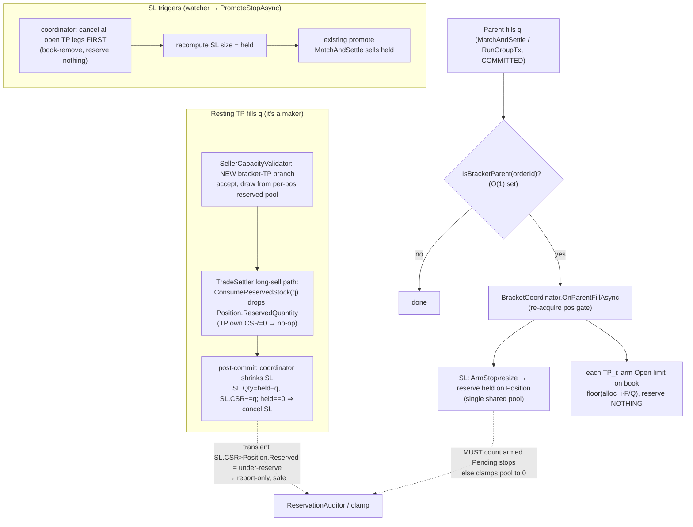

# P4 Bracket — Hardened Reservation & OCO Settlement Design

## Context

P4 adds bracket orders: a parent entry plus a stop-loss (SL) and up to three scale-out
take-profit (TP) legs, OCO-grouped, armed automatically as the parent fills. Most of P4 is
mechanical (model field, migration, DTO, UI). This plan hardens the **one conservation-critical
seam** the existing plan under-specifies: how the SL and TP legs *share one reservation* of the
held shares, and how a TP fill / SL fire settle without breaking share/cash conservation.

I traced the real settlement, reconcile, hydration, and promote code (cited below). The trace
surfaced a **load-bearing fact that reshapes the design** and resolves the six open forks in the
design note. The owner asked for a hardened design **plus a risk register** like P1/P2.

### Headline finding (this is the crux — everything hangs off it)

The reservation reconciler **excludes armed `Pending` stops from the expected reservation sum**, and
the auto-clamp (`Bots:ReconcileClamp` defaults to **true**, fired periodically by
`AiTradeService.cs:451`) would therefore **zero out the SL's pooled reservation**:

- An armed sell-stop **does** reserve shares on `Position.ReservedQuantity` at arm time — a stop is
  not `IsMarketOrder` while armed, so it takes the `!shortOpen` long-reserve branch
  (`OrderSettler.cs:99-133`).
- But `ReconcileReservationsAsync` only sums sells matching `o.IsOpen && o.IsLimitOrder` into
  `expectedQtyByPos` (`AccountsCache.cs:442`). A `Pending` stop is `IsArmed` + `IsStopOrder` →
  excluded. It also isn't `IsClosed`, so it isn't even logged as an offender — it's simply invisible.
- `ClampPositionAsync` re-derives the expectation from `GetOpenSellsForUser`, which filters
  `!o.IsOpen` (`OrderRegistry.cs:71`) — also excluding the armed stop.
- Net: for a bracketed long, `Position.ReservedQuantity == held` (held by the SL) but
  `expected == 0` → delta `+held` reads as **phantom** → the clamp snaps `ReservedQuantity` to 0,
  silently unprotecting the entire position.

This is the same class of gap P1 hit with short collateral (register #8), and the fix is the same
shape: **teach the reconciler + clamp to count the armed leg's reservation.** It also fixes a
latent pre-P4 bug for *standalone* armed sell-stops (and buy-stops on the fund side).

Crucially, fixing it also makes the **post-commit handoff safe**: when a TP fills `q`, the Position
reservation drops to `held−q` immediately but the SL's per-order field still reads `held` until the
coordinator resizes it. That transient is `actual(held−q) − expected(held) = −q < 0` — the
**under-reserve** direction, which the clamp treats as **report-only** (`AccountsCache.cs:564-565`).
So the steady-state fix and the transient window are covered by the same change.

## Hardened reservation model (Model B — confirmed correct)

For a long bracket holding `held` shares: the **SL reserves the full `held`** on the Position (one
shared pool). Each **TP rests on the book as an `Open` limit sell reserving nothing**
(`CurrentSellReservedQty = 0`), drawing from the SL's pool. A TP fill of `q` drops
`Position.ReservedQuantity` by `q` (the existing long-sell `ConsumeReservedStock` path already does
this) and the coordinator shrinks the SL to `held−q`. An SL fire cancels all open TPs and sells the
full `held`. This is correct (a downside crash sells everything via the SL, not just an uncovered
remainder) and matches IBKR/Alpaca/TT. The "remainder" model is rejected — it leaves shares parked
in upside TP limits unprotected.

Short bracket is the cash mirror: SL = buy-stop holding the cover budget in `Fund.ReservedBalance`;
TP buy-limits draw on it; a TP buy-to-close releases proportional `ShortCollateral` via the existing
P1 path. Same reconciler fix, fund side.

## Fork resolutions (the six questions, answered against the code)

| # | Fork | Resolution |
|---|------|-----------|
| 1 | Handoff site: inline `TradeSettler` vs post-commit coordinator | **Post-commit coordinator.** `TradeSettler` already drops `Position.ReservedQuantity` correctly via `ConsumeReservedStock` (`:422`); only the SL *order field* + size lag, and that lag is the safe under-reserve direction. Inline would force `TradeSettler` to reach a non-batch sibling — a layering break in conservation-critical code. |
| 2 | SL-fire sibling cancel: bracket-aware promote vs hook in `PromoteStopAsync` | **Hook in `PromoteStopAsync`** (`OrderExecutionService.cs:255`) delegating to the coordinator. Cancel TPs in their own book-lock/gate/tx section *before* the existing promote→`MatchAndSettleAsync` runs. The SL is still off-book (`Pending`) during the cancel, so there is no double-sell window. Watcher drains promotes single-reader, so no concurrent promote of the same bracket. |
| 3 | Does the shared pool need a `ReservationAuditor` change? | **Yes — mandatory (the headline fix).** Count armed `Pending` sell-stops' `CurrentSellReservedQty` in `expectedQtyByPos` and in `ClampPositionAsync`; mirror for armed buy-stops' `CurrentBuyReservation` on the fund side. Exact analog of P1 register #8. |
| 4 | TP allocation as the parent fills | **Pro-rata of cumulative fill, integer floor, SL absorbs the remainder.** `TP_i target = floor(allocated_i × F / Q)` capped so `Σ TP_i ≤ F`; the SL always covers `F − Σ(TP filled)`, so rounding crumbs ride the SL and `Σ` never exceeds held (invariant 1). |
| 5 | React post-commit (re-acquire gate) vs in-tx | **Post-commit coordinator**, reusing `ArmStopAsync` (`:233`) for the SL leg. In-tx would thread bracket policy into `TradeSettler`/`RunGroupTxAsync` and hold the book lock across child arming — lock-scope + layering violation. The brief unprotected window (parent filled, child not yet armed) is inherent to "arm after fill" and identical to standalone P2 stops. |
| 6 | Hot-path detection: `ParentOrderId is not null` vs explicit flag | **`ParentOrderId is not null && IsSellOrder && IsLimitOrder`** is cheap (null check + two enum compares) and sufficient — the SL is `IsStopOrder`, the parent has no `ParentOrderId`. No new column. The parent-fill hook guards with an O(1) in-memory `IsBracketParent(orderId)` set so non-bracket fills pay nothing. |

## Control flow

## Implementation by layer (ordered — auditor fix is the gate)

**Step 0 — Reconciler/clamp fix FIRST (unblocks everything; independently shippable).**
- `AccountsCache.ReconcileReservationsAsync` (`:439-464`): include armed sell-stops in
  `expectedQtyByPos` — change the inner guard to
  `(o.IsOpen && o.IsLimitOrder) || (o.IsArmed && o.IsStopOrder && o.IsSellOrder)`. Bracket TPs are
  open limits with `CSR=0`, so they contribute 0 naturally (no double count).
- Mirror on the fund side (`:410-437`): include `o.IsArmed && o.IsStopOrder && o.IsBuyOrder` with
  `CurrentBuyReservation` in `expectedBalByFund` (covers buy-stops and the short-bracket SL).
- `ClampPositionAsync` (`:606-618`) / `ClampFundAsync` (`:583-604`): extend the re-derivation to
  include armed stops. `GetOpenSellsForUser`/`GetOpenBuysForUser` filter `!IsOpen`, so add
  `GetArmedStopsForUser(userId, stockId/ccy, side)` to `IOrderRegistry` (mirror the existing
  helpers; filter `o.IsArmed && o.IsStopOrder`) and fold them into `expected`.
- Add a property test asserting a standalone armed sell-stop (and buy-stop) survives a
  `clamp=true` reconcile — this is the pre-P4 latent-bug regression guard.

**Step 1 — Model + persistence (mechanical, per existing plan §"Where it lives").**
- `Order.cs`: `int? ParentOrderId`; `Statuses.Attached` (dormant) added to the validation
  whitelist (`:182`, `:225`) and to `Clone`; helpers `IsAttached => Status==Attached`,
  `IsBracketChild => ParentOrderId is not null`. Keep `IsClosed` terminal-only so `Attached`/armed
  children are never pruned.
- `OrderRow`/`OrderMapper`/`KseDbContext` gain `ParentOrderId`; hand-written column lists in
  `PgDBService.Orders.cs`. Migration `BracketOrders` (nullable `ParentOrderId`).
- Cold-load: `Attached` children rehydrate dormant (NOT armed, NOT on book, reserve nothing);
  already-armed SL legs rehydrate via the existing P2 armed-stop path
  (`StopTriggerWatcher.ColdLoadAsync` + `GetOpenOrdersForUsersAsync`).

**Step 2 — `BracketCoordinator` (new, in `MarketEngineServices`).**
- Owns the in-memory `HashSet<int> _bracketParents` (+ a `parentId → child orderIds` index),
  seeded at place time and rehydrated on cold-load from children's `ParentOrderId`.
- `IsBracketParent(int orderId)` — O(1) hot-path guard.
- `OnParentFillAsync(Order parent)` — under the `(user, stock)` position gate (and fund gate for
  short brackets): compute `held = parent.AmountFilled − Σ(child.AmountFilled)`; arm/resize the SL
  to `held` (reuse `ArmStopAsync` on first arm, a gated resize thereafter — mirror
  `StopModifier.ApplyChangeAsync` for the reservation delta); arm/resize each TP_i to
  `floor(alloc_i·F/Q)` on the book reserving nothing.
- `OnChildFillAsync(Order tp, int q)` — post-commit (B1): shrink SL to new `held`; if `held==0`
  cancel SL; if a **limit** parent still rests, cancel its remainder.
- `OnStopFiringAsync(Order sl)` — cancel all open TP siblings (book-remove, no reservation release),
  recompute SL size to `held`.

**Step 3 — Wire the hooks into the engine (conservation-critical).**
- `SellerCapacityValidator.Filter` (`:36-109`): add a **bracket-TP branch** mirroring the P1
  short branch (`:57-67`). Detect via `ParentOrderId is not null && IsSellOrder && IsLimitOrder`.
  Accept by drawing from a **per-position reserved pool** seeded to `Position.ReservedQuantity`
  (the pool the sibling SL holds), decremented per accepted fill so two TP fills in one batch can't
  over-draw `held`. (Buy side: short-bracket TP buy-to-close already flows the existing buy path;
  no validator change needed there.)
- Parent-fill hook: in `MatchAndSettleAsync` after the lock block commits (`OrderExecutionService.cs:208`)
  and in `RunGroupTxAsync` after commit (`:990`), for each settled order where
  `IsBracketParent(orderId)` and `AmountFilled` increased → `await OnParentFillAsync(parent)`.
- Child-fill hook: same post-commit points, for each filled order where
  `IsBracketChild && IsLimitOrder` → `OnChildFillAsync`.
- SL-fire hook: in `PromoteStopAsync` (`:255`), if `order.IsBracketChild && order.IsStopOrder`,
  `await _bracketCoordinator.OnStopFiringAsync(order)` *before* `MatchAndSettleAsync`.

**Step 4 — API/DTO + UI (mechanical, per existing plan).** `PlaceOrderRequest` optional bracket
spec (≤3 TP `{Price,Qty}` + SL fields); controller + `ApiOrderEntryClient`; validate (Σ TP qty ≤
parent qty, each leg on the profit/protective side, TP prices strictly ordered away from entry).
`PlaceOrderView.xaml`: wrap the ticket body in a `ScrollView` (bounded panel height), add SL field +
up-to-3 TP rows using shared styles from `Resources/Styles/`. Existing chart stop-line (P3) +
`OpenOrdersView` render every armed leg through current paths.

## Risk register (P4 — failure modes to design against)

1. **SL pool clamped to zero (CRITICAL).** Reconcile/clamp excludes armed stops → SL's `held`
   reservation read as phantom and zeroed, unprotecting the position. **Fix:** Step 0. Regression
   test with `clamp=true`.
2. **TP fill double-spends the pool within one batch.** Two sibling TPs filling in one settle batch
   each see `Position.ReservedQuantity` and could over-accept. **Fix:** validator draws from a single
   per-position reserved pool, decremented per accepted fill (Step 3).
3. **SL fires while a TP fill is in flight (double-sell).** **Mitigated** by the book lock: the
   TP-fill settle and the coordinator's TP-cancel section both take the stock's book lock →
   serialized; SL is off-book until promoted. Test the interleaving.
4. **SL fires in the transient window before the coordinator resized it.** SL.Quantity still reads
   old `held` while only `held−q` shares remain → settlement "Insufficient reservation" fail.
   **Fix:** `OnStopFiringAsync` recomputes SL size from live `held` before matching; coordinator
   resize holds the position gate so it serializes against the fire.
5. **Cancel semantics.** Cancel unfilled parent → discard dormant children (no reservation to
   release). Cancel partially-filled parent → keep armed children. Cancelling the SL alone must
   leave TPs unprotected-pool-less → either forbid cancelling one leg of a live bracket or cascade.
   **Decision:** cancelling the SL of a partially-filled bracket cancels the whole bracket group
   (the TPs cannot rest unprotected); cancelling a single TP just releases its book slot (SL grows
   back to cover). Validate in `OrderValidator`/cancel path.
6. **Restart rehydration.** `Attached` children must rehydrate dormant (not armed, reserve nothing);
   armed SL must rehydrate its pool via the P2 path AND be counted by the now-fixed reconciler.
   Test: restart mid-bracket → no clamp cancels the SL, TPs come back on book reserving nothing.
7. **Short bracket (highest residual complexity).** Cash-collateral SL (buy-stop) + buy-limit TPs +
   proportional `ShortCollateral` release on each TP cover. Symmetric to the share side but exercises
   the fund-side reconciler fix and the P1 collateral-release path together. **Recommend:** cover it
   explicitly in the property test; if it proves unstable, ship long brackets first and gate short
   brackets behind a follow-up (does not relitigate scope — just sequencing if needed).
8. **Allocation rounding leaves shares stranded.** Floor-per-TP with the SL absorbing the remainder
   guarantees `Σ TP ≤ held` and full protection; assert invariant 1 in the test.

## Invariants the implementation must hold (assert in tests)
1. At rest, `SL.CurrentSellReservedQty + Σ(TP.CurrentSellReservedQty=0) == Position.ReservedQuantity == held`.
2. `ConservationProbe` green across every bracket fill (parent partial, TP fill, SL fire).
3. `ReservationAuditor` (clamp=true) never cancels/zeros a healthy bracket — steady state and across
   the post-commit transient and a restart.
4. The position is fully protected: at any instant the SL covers `held`, independent of TP count/state.
5. Lock order book → gates → tx never violated; the coordinator re-acquires gates, never holds the book.

## Verification
- Build: `dotnet build KieshStockExchange.Server/KieshStockExchange.Server.csproj` and the client
  csproj per CLAUDE.md, **0 warnings**.
- New `KieshStockExchange.Tests` property test (mirror the P1/P2 conservation tests): place a bracket
  (1–3 TPs); drive partial parent fills → SL + every TP resize to cumulative fill/slice (A1); fill
  TPs in sequence → each shrinks the SL (B1); SL fire → all open TPs cancel and `held` sells; partial
  TP coverage leaves the remainder on the SL; cancel-unfilled-parent discards children,
  cancel-partial-parent keeps them; run a `clamp=true` reconcile after each step and assert no leg is
  cancelled and invariants 1–3 hold; restart mid-bracket → hydration preserves the pool. Include a
  short-bracket variant.
- Regression: standalone armed sell-stop and buy-stop survive a `clamp=true` reconcile (Step 0).
- Manual: market-buy bracket (instant fill → all legs armed) and limit-buy bracket (slow fill → legs
  grow); scale out through TP1/TP2/TP3; trigger the SL; `ConservationProbe` + `ReservationAuditor`
  soak clean.
