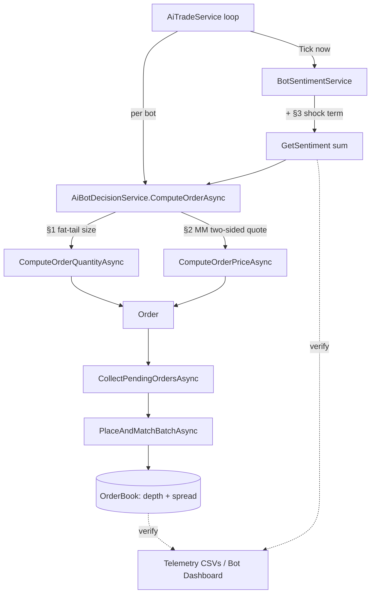

# Bot market-realism spec — fat tails, book depth, news events

The bot fleet already models directional/cash bias, watchlist momentum,
multi-timescale AR(1) sentiment, style-dependent extreme reactions, bursts,
post-trade quiet periods, and hourly cash injection (CLAUDE_NOTES §3.3–3.5).
This document specifies the **next three realism gaps** and how to close them
without disturbing the existing decision pipeline. It is a design proposal, not
code — an implementer should land each feature inert-first/flag-gated, the way
§3.4–3.5 were landed.

The three features are independent. Recommended landing order is **§3 → §1 → §2**
(cheapest and highest code-reuse first, most invasive last). See §4 for rollout
and the `/Tools` seeding caveat.



---

## §1 — Order-size fat tails ✅ DONE (config-constant scope, `7184463`)

Shipped as shared config constants (`Bots:FatTails / TradeSizeTailShape /
BlockTradeProb / BlockTradeMultiple`) rather than per-bot `AIUser` knobs — no schema
or `/Tools` change. Power-skew reshape + rare block multiplier in
`ComputeOrderQuantityAsync`; downstream clamps cap blocks. Per-bot knobs (the §5
seeding chain below) remain deferred. Original design follows.


### Why
Real order flow is heavy-tailed: most orders are small, but a long upper tail of
large orders (and occasional block trades) carries a disproportionate share of
volume. Our bots draw size from a near-uniform band, so the volume distribution
is flat and unrealistically thin in the tail — large prints essentially never
happen, which mutes price impact and makes depth consumption too smooth.

### Current behavior
`AiBotDecisionService.ComputeOrderQuantityAsync` (`AiBotDecisionService.cs:266`)
sizes every order as a uniform draw between the per-bot min/max fractions:

```csharp
// AiBotDecisionService.cs:272
var tradePrc = Lerp(user.MinTradeAmountPrc, user.MaxTradeAmountPrc, ctx.Decimal01(user.AiUserId));
```

A one-sided aggressiveness jitter is added, then the notional is clamped to the
remaining position room (`PerPositionMaxPrc`) and free balance (lines ~296–320).
Net result: trade size ≈ uniform on a bounded band — no tail.

### Proposed change
Reshape the `tradePrc` draw inside the same method (do **not** touch the
downstream clamps — they already cap block trades safely against position/cash
limits, so this introduces no new failure path):

1. **Lognormal body.** Map the uniform `ctx.Decimal01` draw through a
   lognormal-shaped transform so the *typical* order sits near `MinTradeAmountPrc`
   with a heavy right tail reaching `MaxTradeAmountPrc`. A skew parameter
   (`TradeSizeTailShape`, below) controls tail heaviness; at `0` it degrades to
   the current near-uniform behavior, preserving back-compat.
2. **Rare block trade.** With probability `BlockTradeProb`, multiply the drawn
   size by `BlockTradeMultiple`. The existing `roomValue`/`freeBalance` clamps
   truncate it to whatever capacity the bot actually has, so a block roll on a
   nearly-full bot simply maxes out rather than erroring.

All randomness flows through `ctx.GetRandom`/`ctx.Decimal01`, so per-bot
determinism (daily-seeded RNG, `AiBotContext.cs:65`) is preserved.

### New tunables & wiring
Three per-bot knobs, defaulted in `AIUser` so the feature works **before** any
re-seed (same pattern as `ExtremeReactionRandomnessPrc`, `AIUser.cs:116`):

| Knob | Range | Default | Meaning |
|---|---|---|---|
| `TradeSizeTailShape` | [0, 1] | ~0.5 | 0 = uniform (today); 1 = heaviest tail |
| `BlockTradeProb` | [0, ~0.05] | ~0.01 | per-order chance of a block multiplier |
| `BlockTradeMultiple` | [1, ~10] | ~4 | size multiplier when a block fires |

Wiring per knob (mirror an existing decimal knob end-to-end) — runtime side:
`AIUser` field + validation → `AIUserRow` column + `AIUserMapper.ToDomain/ToRow`
(`AIUserRow.cs`) → `PgDBService.Misc.cs` SQL + EF model + migration. Seeding side
(Config.py/Person.py/ExcelLayout.py/importer): see **§5**.

### Risks
- Tail draws bunch into the position/cash clamps → block trades silently
  truncate. Acceptable, but verify the *effective* size distribution post-clamp,
  not just the pre-clamp draw.
- Heavier tails raise single-tick price impact; confirm the matching/settlement
  path and reservation math handle larger single fills (they already do — same
  code path, just bigger quantities).

### Verification
- Histogram of executed trade sizes (from the stats/economy volume telemetry)
  shows a clear right tail and occasional blocks vs. today's flat band.
- `FailuresByCategory` (economy telemetry) unchanged — no new rejections.

---

## §2 — Spread & book depth (real market-maker quoting)

### Why
"Market maker" is currently a strategy label, not a behavior. MM bots don't post
continuous two-sided quotes, so the resting book around mid is thin and the
bid-ask spread is whatever incidental limit orders happen to leave — there is no
agent actually *making* a market. Realistic markets have liquidity providers
quoting both sides at a controlled spread, which is what tightens spreads and
deepens the book.

### Current behavior
`AiStrategy.MarketMaker` only nudges the market-vs-limit mix and picks a
contrarian extreme style — it never posts paired quotes:

```csharp
// AiBotDecisionService.cs:149-150  (inside ChooseOrderType)
case AiStrategy.MarketMaker:
    effectiveUseMarket = Math.Max(0m, effectiveUseMarket - 0.15m); // lean toward limits
```
```csharp
// AiBotDecisionService.cs:406
AiStrategy.MarketMaker => ExtremeReactionStyle.Contrarian,
```

Limit prices come from a single-sided offset off the anchor
(`ComputeOrderPriceAsync`, `AiBotDecisionService.cs:216`; anchor = mid via
`GetMidPriceAsync` `:246`, else last trade). One order per bot per tick is
collected (`CollectPendingOrdersAsync`, `AiTradeService.cs:444`, returns
`List<(AIUser, Order)>`) and matched (`PlaceAndMatchBatchAsync`,
`OrderExecutionService.cs:356`). The book itself already exposes everything
needed to quote and measure: `OrderBook.Snapshot()` / `ToDepthSnapshot()` and
`PriceLevel(Price, Quantity)` (`Helpers/OrderBook.cs:277,824,885`).

### Proposed change
Give MM bots a dedicated quoting path that places resting orders **symmetrically
around mid** at a target half-spread, replenishing as they fill. Two options:

**Option A (recommended) — alternate sides across ticks, anchored to mid.**
On each MM decision, force a limit order on the side currently under-represented
in that bot's open orders, priced at `mid × (1 ± QuoteHalfSpreadPrc)`. Over
successive ticks the bot maintains both a working bid and a working ask near mid;
aggregate depth comes from many MM bots plus each bot's multiple resting orders
(bounded by `MaxOpenOrders`, refreshed by `PruneWorstOrdersAsync`).
- Pro: stays within the existing one-order-per-bot-per-tick batch shape — minimal
  blast radius, no engine changes.
- Con: a single bot is not *instantaneously* two-sided; depth is statistical.

**Option B — true paired quotes.** Emit a bid **and** an ask per MM tick.
- Pro: genuine instantaneous two-sided depth per bot.
- Con: `CollectPendingOrdersAsync` must yield multiple orders per user, and
  `PlaceAndMatchBatchAsync` must accept them; doubles per-bot reservation and
  `MaxOpenOrders` pressure. Larger change to the loop/engine contract.

Recommend shipping **A first** (it already produces tighter spreads and deeper
books in aggregate), and treating B as a later upgrade if per-bot two-sidedness
proves necessary.

### New tunables & wiring
| Knob | Range | Default | Meaning |
|---|---|---|---|
| `QuoteHalfSpreadPrc` | [0.0005, 0.02] | ~0.003 | half-spread each MM quote sits off mid |
| `QuoteLevels` | [1, 5] | 1 (A) / 2 (B) | price-ladder rungs per side |

Knobs default in `AIUser` and wire through `AIUserRow`/`AIUserMapper` as in §1.
Tune so `QuoteHalfSpreadPrc` ≪ `PruneDistanceFactor × MaxLimitOffsetPrc`
(`AiBotStateService.cs:39,243`) — otherwise fresh near-mid quotes get pruned as
"worst-priced." Quoting only fires when `GetMidPriceAsync` returns a mid (a
two-sided book exists); fall back to current single-sided behavior otherwise.

### Risks
- Self-/cross-crossing: tight half-spreads can let an MM bot's bid lift another's
  ask immediately. Acceptable (it *is* trading), but watch wash-trade-like loops
  between MM bots and confirm reservation math nets out.
- Prune interaction (above) — the most likely "quotes vanish" footgun.
- Option B changes the batch contract — gate it carefully and test reservation
  release on partial-group failure (`OrderExecutionService.cs:675`).

### Verification
- Time-averaged bid-ask spread (computed from `OrderBook.Snapshot()`) narrows on
  MM-covered stocks vs. a no-MM baseline; depth-at-mid (sum of top-level
  `PriceLevel.Quantity`) rises.
- Spread trends down as MM-bot count per stock rises.

---

## §3 — News / earnings events (discrete shocks) ✅ DONE (`a3bb6f9`)

Shipped in `BotSentimentService` as a per-stock Poisson shock layer (arrival + decay +
inject + `Shock` telemetry column), config-driven (`Bots:NewsEvents` +
`ShockMeanIntervalHours/Magnitude/DecayPerTick`). Original design follows.


### Why
Sentiment today is smoothly mean-reverting AR(1) noise — there are no discrete,
market-moving events. Real markets gap on news and earnings: a sudden directional
jump that decays over minutes-to-hours. CLAUDE_NOTES §3.4 notes Poisson shocks
"were considered and dropped"; this re-introduces them cleanly as an additive
term, reusing the overflow→extreme-reaction machinery that already exists.

### Current behavior
`BotSentimentService.GetSentiment` (`BotSentimentService.cs:187`) returns the
**un-clamped** sum of the per-stock and global AR(1) factors:

```csharp
// BotSentimentService.cs:189-193
decimal sum = 0m;
if (_perStock24h.TryGetValue(stockId, out var v24)) sum += v24;
if (_perStock1h.TryGetValue(stockId,  out var v1h)) sum += v1h;
if (_perStock10m.TryGetValue(stockId, out var v10)) sum += v10;
if (_perStock1m.TryGetValue(stockId,  out var v1m)) sum += v1m;
```

When this sum exceeds ±1, the consumer treats it as an extreme event and applies
a style-dependent reaction (`ApplyExtremeReaction`, `AiBotDecisionService.cs:369`;
styles at `:400`). Factors evolve once per `Tick(now)` (`BotSentimentService.cs:91`)
using the seeded `_rng` (`:81`, `RngSeed=43`), and snapshots are emitted to CSV
via `SentimentSample` (`:346`) / `BuildCsv` (`:305`).

### Proposed change
Add a transient **shock layer** entirely inside `BotSentimentService` — no
decision-service change is needed, because the existing overflow path converts
any large sentiment value into trading pressure automatically.

1. **State.** Add `Dictionary<int, decimal> _shock` (per stock).
2. **Arrival.** In `Tick`, run a low-rate Poisson roll off the existing `_rng`
   (a per-tick probability derived from a target mean inter-arrival of hours).
   On fire, set `_shock[stockId] += ±ShockMagnitude` (sign random; magnitude big
   enough to push the sum past ±1 and trip an extreme reaction).
3. **Decay.** Each `Tick`, multiply every `_shock` entry by a decay factor
   (`ShockDecayPerTick`) so the jump fades over a realistic window, then drop
   negligible entries.
4. **Inject.** Add `_shock[stockId]` to the `sum` in `GetSentiment`.

Events are **shared across all bots** (market-wide news), and fully deterministic
via the existing seeded `_rng` + `Reset` (`:226`).

### New tunables & wiring
Service-level constants (in the existing `#region private constants`,
`BotSentimentService.cs:23`) — no per-bot knobs:

| Constant | Meaning |
|---|---|
| `ShockMeanIntervalHours` | target mean time between events per stock |
| `ShockMagnitude` | jump size added to the sentiment sum |
| `ShockDecayPerTick` | exponential decay applied each tick |

Telemetry: add a `Shock` field to `SentimentSample` (`:346`) and emit it in
`BuildCsv` (`:305`) so events are visible in the dashboard CSV.

### Risks
- Magnitude vs. the ±1 overflow threshold and the per-bot
  `ExtremeReactionRandomnessPrc` gate (`AiBotDecisionService.cs:414`) must be
  tuned together, or shocks either do nothing or whipsaw the whole fleet.
- Determinism: only ever advance shock state inside `Tick` on the loop thread
  (`Tick`/`GetSentiment` are documented loop-thread-only, `:18`) and reset
  `_shock` in `Reset`.

### Stretch (out of scope)
Sector-wide contagion (one event moving correlated names) needs a
`Stock.Sector`/grouping field that does not exist today — call it out as a future
follow-up, not part of this work.

### Verification
- Sentiment CSV shows discrete spikes in the new `Shock` column that decay
  exponentially, while the AR(1) columns stay smooth.
- The affected stock's price series shows a matching transient move followed by
  reversion; quiet periods between events look like today.

---

## §4 — Rollout, flags, and seeding

- **Order:** §3 (self-contained in `BotSentimentService`, highest reuse) → §1
  (single method + knobs) → §2 (touches quoting; Option B touches the batch
  contract). Land each **inert-first / flag-gated**, matching the §3.4–3.5
  precedent, so the fleet's behavior can be A/B'd against a baseline.
- **Defaults in code, not data.** Every new per-bot knob (§1, §2) gets a sane
  default on the `AIUser` model — exactly like `ExtremeReactionRandomnessPrc`
  (`AIUser.cs:116`) and `CashInjection*` (`:130,144`). This means the features
  run correctly **before** `AIUserData.xlsx` is regenerated; the columns just
  read as defaults until then. Per-bot *variation* comes from the seeding work
  in §5, which can land independently.
- **Persistence:** Phase 7c has landed — the live path is Postgres, so new
  `AIUserRow` columns also need entries in `PgDBService.Misc.cs` (the AIUsers
  `INSERT` column list + `VALUES` params, the `SELECT` list, and the `UPDATE`
  set-list), the EF model in `KseDbContext`, and a new EF migration. Keep the
  `ToDomain`/`ToRow` mappers symmetric (`AIUserRow.cs`). Full step list in §5.

---

## §5 — `/Tools` seeding & persistence wiring (concrete)

Per-bot variation in the new §1/§2 knobs is generated by the Python tooling and
flows xlsx → importer → DB. The seeder reads the `Profile` sheet **by header
name** (`row["ColumnName"]` in `ExcelSeedService.SeedAIProfilesAsync`), so the
**only ordering constraint** is that `ExcelLayout.prepare_profile_sheet`'s header
list and `Person.ToProfileList`'s value list stay in lockstep — the C# side then
matches purely by name. Add new columns at the **same position in both** (e.g.
just before `HomeCurrency`, mirroring how the cash-injection columns sit today).

### Per knob, end to end

1. **`Tools/Config.py`** — add distribution tunables next to the existing blocks
   (`Config.py:111-227`) and a guard in `_validate()` (`:232`). Suggested:
   - §1: `TRADE_SIZE_TAIL_SHAPE_*` (base/jitter), `BLOCK_TRADE_PROB_*`,
     `BLOCK_TRADE_MULTIPLE_*` (base/floor/cap) — model on the
     `CASH_INJECTION_*` floor/cap/jitter pattern (`:176-184`).
   - §2: `QUOTE_HALF_SPREAD_*`, `QUOTE_LEVELS_*` — only meaningful for
     `MarketMaker` (strategy id 1); others should seed the inert default.
   - Add each new constant to the `_validate()` print/range checks.
2. **`Tools/Person.py`** — assign in the relevant builder
   (`_trade_limits`/`_order_types`, `Person.py:185-224`), e.g. derive from
   `self.aggressive` via the existing `skewed01`/`jitter`/`clamp` helpers; gate
   the §2 knobs on `self.strategy == 1`. Then append the rounded values to
   **`ToProfileList`** (`Person.py:253-281`) in the chosen column order.
3. **`Tools/ExcelLayout.py`** — add the matching header strings to
   `prepare_profile_sheet` (`ExcelLayout.py:71-82`) at the same position.
   (`GenerateAIUsers.py` needs no change — it appends `ToProfileList` rows
   positionally and already calls the post-pass `assign_cash_injection_knobs`;
   add an analogous post-pass call only if a knob needs portfolio-relative
   scaling like cash injection did.)
4. **`ExcelSeedService.SeedAIProfilesAsync`** (`ExcelSeedService.cs:266`) — read
   each new column with `ParsingHelper.TryToDecimal(row["NewColumn"]...)` and set
   it on the `AIUser` being built, alongside the existing decimal reads (`:291`+).
5. **Persistence (Phase-7c path):** `AIUserRow` column + `AIUserMapper`
   (`AIUserRow.cs`); `PgDBService.Misc.cs` AIUsers `INSERT`/`SELECT`/`UPDATE`
   lists (`:24,34,44,403`); `KseDbContext` model; `dotnet ef migrations add`.

### Regenerate & verify
- `python Tools/GenerateAIUsers.py` → new `AIUserData.xlsx` with the columns.
- Re-seed and spot-check: `SeedAIProfilesAsync` populates the new knobs; a few
  bots show non-default, strategy-appropriate values (e.g. only MM bots carry a
  meaningful `QuoteHalfSpreadPrc`).
- `Config._validate()` passes; ranges respect the `AIUser` validators
  (`AIUser.cs:218-239`) so no bot seeds as `IsInvalid`.

## Verification checklist (whole effort)
- Each feature toggles cleanly on/off and the off state reproduces today's
  behavior bit-for-bit (deterministic seeds unchanged).
- Telemetry confirms each effect: size histogram (§1), spread/depth series (§2),
  sentiment-shock column + price transients (§3).
- No regression in `FailuresByCategory` or reservation/settlement invariants.
