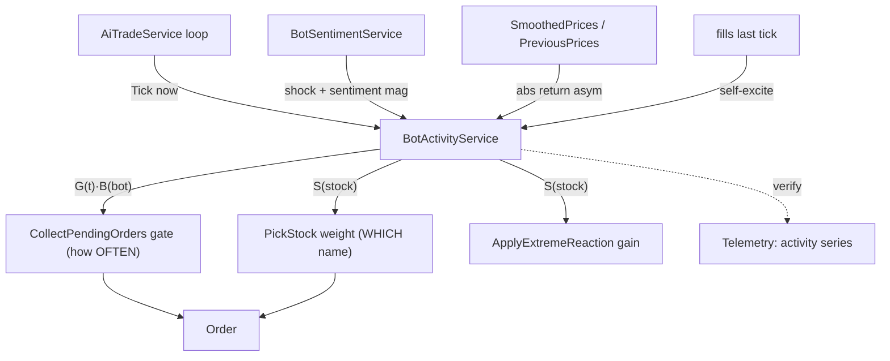

# Bot variable-volume spec — a self-exciting market-activity field

Companion to `docs/bot-market-realism.md`. That doc added *direction* realism (fat tails,
news shocks, MM quoting). This one adds **volume** realism: trading activity that clusters
and varies instead of running flat.

The fleet today trades at a roughly **constant rate** — each bot gates on a fixed
`TradeProb` + `DecisionInterval`, nudged only by bursts. Direction comes from sentiment;
volume does not respond to it. Real markets do the opposite: volume *clusters* and
*correlates with volatility* — quiet consolidation at low volume, then news or a large move
ignites a high-volume directional burst that decays. That single property (volatility
clustering / self-exciting flow) is what makes a chart "breathe" instead of buzz, and it is
also the lever on the current "chart bounces up and down too much" complaint.

This is a design proposal, not code. Land it **flag-gated / inert-first**, the way
`bot-market-realism.md` §3.4–3.5 were landed: off → the field is identically 1 everywhere
and the bot stream is byte-for-byte unchanged.

**Tune by eye, not by test.** This is a believability feature for a human looking at the
chart, not a calibration against real data. The academic stylized-fact battery (§7) is
recorded for reference, but the acceptance bar is "does it look alive + did the conservation
guards stay clean." Build the full shape below, then tune the knobs by watching.



---

## §1 — The field

A **positive multiplier on participation**, mean ≈ 1, decomposed multiplicatively so each
layer is independently tunable and the layers compose without drifting the mean:

```
A(bot, stock, t) = G(t) · S(stock, t) · B(bot, t)
```

Each factor is `exp(·)` of a zero-mean log-process → log-normal, median 1 (subtract σ²/2 if
mean-exactly-1 matters). Off → every factor ≡ 1.

Lives in a **new `BotActivityService`**, a sibling of `BotSentimentService` mirroring its
shape: one `Tick(now)` per bot-loop iteration on the loop thread (no locks), a `Reset(now)`,
a seeded `_rng`, per-stock combined cache for O(1) hot-path reads, and an NDJSON ring-buffer
export. Keeping it separate from `BotSentimentService` keeps **direction** (signed sentiment)
and **intensity** (non-negative activity) as distinct concepts.

### §1.1 — G(t): global / regime (global variance)
```
G(t) = ActivityBaseline · envelope(timeOfDay) · exp(g_ring(t))
```
- `g_ring`: a clone of the slow global AR(1) ring in `BotSentimentService` (a couple of slow
  τ, small log-σ). Models "busy day vs quiet day," slow regime.
- `ActivityBaseline` (~0.6): centers calm-regime participation *below* 1 so quiet is genuinely
  quiet and spikes exceed 1. **This is the primary lever on the "too bouncy" chart** — see §5.
- `envelope(timeOfDay)`: optional deterministic U-shape (busier open/close). A 24/7 sim has no
  session, so v1 ships this **off** (≡ 1) or uses a synthetic daily cycle; flagged either way.

### §1.2 — S(stock, t): per-stock, self-exciting (stock variance + news/trending)
```
S = clamp( exp(s_ring(t) + h(stock, t)), Floor, S_max )

h(t+Δ) = decay(h, Δ) + w_news·|shock|
                     + w_moveUp·posReturn + w_moveDown·negReturn   (leverage asymmetry)
                     + w_sent·max(0, |sentiment| − θ)
                     + w_self·fillsLastTick                          (Hawkes self-excite)
```
- `s_ring`: clone of the per-stock fast→slow ring → baseline per-name "chattiness" dispersion.
- `h`: a **decaying self-exciting intensity** (Hawkes kernel) — the heart of the feature. All
  excitation terms read state that already exists, so they cost no extra RNG and are
  call-order-independent:
  - **news** → `|_shock[stockId]|` from `BotSentimentService` (reuse; near-free).
  - **big move** → recent `|EWMA return|` from `SmoothedPrices`/`PreviousPrices`. **Asymmetric:**
    `w_moveDown > w_moveUp` so a −2 % move excites more than a +2 % (leverage effect / "crashes
    are faster than rallies" — the most eye-recognizable real-market texture).
  - **sentiment magnitude** → only the part over `θ`, so only genuinely hot names lift volume.
  - **self-excitation** → fills on this name last tick beget more (true trade-clustering).
- `decay`: **multi-timescale**, not a single ρ. Real volume autocorrelation decays slowly
  (long memory); one exponential gives only short memory. Sum a fast + slow kernel (or accept
  single-ρ as a v1 approximation and note the gap). See §6 for the near-critical tuning that
  keeps the self-excitation lively but stable.
- `Floor` keeps cold names from freezing entirely; `S_max` (~6×) stops one name absorbing the
  whole fleet.

### §1.3 — B(bot, t): per-bot, strategy-flavored (individual variance + strategy approaches)
```
B = exp( b_drift(bot, t) + k_strategy · (avgWatchlistActivity − 1) )
```
- `b_drift`: stateless hash-drift (the `AiBotContext.PersonalSentiment` trick — no stored
  matrix, deterministic, call-order-independent). Slow idiosyncratic "this bot feels active."
- `k_strategy · (avgWatchlistActivity − 1)`: the bot's reaction to how hot **its own watchlist**
  is (`avgWatchlistActivity` = mean `S` over the watchlist). `k_strategy` is where strategies
  diverge:

| Strategy | `k_strategy` | Behavior |
|---|---|---|
| TrendFollower / Scalper | high (+) | chase volume — the herd into hot names |
| MeanReversion / Contrarian | moderate (+) | show up for big moves, but to *fade* |
| MarketMaker | moderate (+), routed to **quoting** | more two-sided refresh when busy → adds the depth that absorbs the move |
| Random / passive / value | ≈ 0 | steady baseline; ignore short-term heat |

---

## §2 — Where it plugs in (two seams, no engine surgery)

**Seam 1 — per-bot gate** (`AiTradeService.CollectPendingOrdersAsync`, the burst/quiet/interval
block at `AiTradeService.cs:761-786`). Stock isn't chosen yet here, so use `G·B`:
```
participationMult  = G(t) · B(bot, t)
effectiveTradeProb = clamp01(user.TradeProb · participationMult)
effectiveInterval  = user.DecisionInterval / clamp(participationMult, lo, hi)
burstEntryProb    *= participationMult     // hot watchlist → more bursts (refines existing burst logic)
```

**Seam 2 — stock selection** (`AiBotDecisionService.PickStock`, the roulette weight loop at
`AiBotDecisionService.cs:539`; already multiplies a base weight by a value-anchor boost). Use `S`:
```
weight_i *= S(stock_i, t) ^ gamma          // volume concentrates on news/trending/hot names
```
And scale the extreme-reaction overflow gain by `S` in `ApplyExtremeReaction`
(`AiBotDecisionService.cs:909`, `OverflowGain` const `:33`) so hot names react harder.

Mapping: **G·B = how often a bot trades; S = which name catches the volume.** Each is
independently observable in telemetry.

---

## §3 — Determinism & performance (the repo's bar)

- All stochastic terms advance only inside one `Tick` on the loop thread, exactly like
  `BotSentimentService.Tick`. `G` and per-stock `S` are cached each tick → O(1) reads on the
  per-bot hot path.
- Driver terms (move / news / sentiment / fills) are deterministic functions of existing state
  → no extra RNG draws, no call-order sensitivity. Only the ring noise uses the seeded `_rng`.
- `B`'s `b_drift` is a pure hash (no state); `avgWatchlistActivity` reads cached `S`. So `B` is
  cheap per-bot-per-tick with no stored matrix.
- `fillsLastTick` for the self-excitation term is collected once per tick from the batch/advanced
  results already flowing through `AiBotStateService.RecordTx` — no new bookkeeping path.
- Flag-gated, inert when off (every factor ≡ 1) → byte-identical to today; deterministic seeds
  unchanged when the flag is off.

---

## §4 — Tunables

Service-level constants in `BotActivityService` (no per-bot Excel columns in v1 — per-bot
variation comes from `b_drift` + `k_strategy`, which keys off the existing `user.Strategy`):

| Knob | Meaning | Starting point |
|---|---|---|
| `Bots:Activity:Enabled` | master flag | false until soaked |
| `ActivityBaseline` | calm-regime center (<1 = quieter lulls) | 0.6 |
| `GlobalTauSec` / `GlobalSigma` | global ring timescales / log-amplitude | clone slow global ring |
| `PerStockTauSec` / `PerStockSigma` | per-stock ring | clone per-stock ring |
| `S_max` / `Floor` | per-stock spike cap / cold-name floor | 6 / 0.2 |
| `gamma` | how hard volume concentrates on hot names (PickStock exponent) | ~1.0 |
| `w_news` | news-shock excitation weight | tune |
| `w_moveUp` / `w_moveDown` | move excitation, **down > up** (leverage) | e.g. 1 / 2 |
| `w_sent` / `theta` | sentiment-magnitude excitation + threshold | tune |
| `w_self` + decay | self-excitation gain + multi-timescale decay → **branching ratio ≈ 0.9** | see §6 |
| `k_strategy[*]` | per-strategy gate responsiveness | per table §1.3 |

---

## §5 — Interaction with the "too bouncy" chart

Variable volume helps the *breathing* texture, but be honest: **thin lulls bounce harder per
order**, so variable volume alone could worsen chop during quiet periods. Today's bounce is
mostly the fast 20 s/90 s sentiment rings getting *full constant volume* on every sign flip.
The fix is two coordinated levers, both in this work:

1. **Lower the baseline** (`ActivityBaseline` < 1) so volume *spikes* only on real activity —
   directional periods get follow-through, quiet periods stop chasing every fast-ring wiggle.
2. **Keep MMs quoting in the lulls** (the `MarketMaker` `k_strategy` routes activity to quoting,
   not taking) so the depth floor survives low volume — otherwise lever 1 backfires.

Optional companion: damp the fastest sentiment ring, or make fast-ring-only churn
low-participation, so the remaining bounce has less fuel.

---

## §6 — Critical tuning: the near-critical subcritical regime

The Hawkes LOB literature finds the **nearly-unstable subcritical regime** is what reproduces
realistic clustering: self-excitation strong enough to cluster, but provably below the runaway
boundary. The control quantity is the **branching ratio** `n` — the expected number of further
events one event triggers. `n < 1` is stable; `n → 1⁻` is maximally lively; `n ≥ 1` runs away.

For an exponential kernel with per-tick decay `ρ` (so memory ≈ `1/(1−ρ)` ticks) and per-event
excitation `w_self`, the branching ratio is the total area under the kernel:

```
n = w_self / (1 − ρ)          ⇒  pick ρ for the memory you want, then  w_self = n·(1−ρ)
```

Example: a ~3-minute memory at 1 Hz → `ρ ≈ 0.994` (`1/(1−ρ) ≈ 167` ticks); target `n ≈ 0.9`
→ `w_self ≈ 0.9·0.006 ≈ 0.0054` per fill. For the **multi-timescale** kernel (§1.2), `n` is
the sum of each component's area; keep the *total* near 0.9 and split it across a fast and a
slow component (the slow one carries the long memory). `S_max` is the hard backstop if a
configuration drifts critical. Tune `w_self` *down* first if activity ever looks explosive.

The other weights (`w_news`, `w_move*`, `w_sent`) are exogenous drivers, not self-feedback, so
they don't enter `n` — set them by eye for how strongly each event type should spike volume.

---

## §7 — Verification (reference only; tune by eye)

Acceptance is visual ("the chart looks alive, lulls and bursts are distinct, down looks noisier
than up") plus the non-negotiable guards: `ConservationProbe` = 0, `CK_*` = 0,
`ReservationAuditor` in tolerance, tests green. The stylized-fact battery below is recorded so
we *could* confirm quantitatively, but it is not the bar:

| Metric | Real-market target |
|---|---|
| Volume autocorrelation | positive, slow decay (long memory) — today fails (flat) |
| Volume–volatility correlation | clearly positive — today fails |
| Squared/abs-return autocorrelation | positive, slow power-law decay (clustering) |
| Return autocorrelation | ≈ 0 beyond ~20 min |
| Return tail index | finite, 2–5 |
| Leverage effect | volatility negatively correlated with returns |
| Intraday volume profile | U-shaped (only if the envelope is enabled) |

The two headline before/afters are **volume autocorrelation** and **volume–volatility
correlation** — both fail outright on today's flat-volume fleet, so they demonstrate the
feature worked.

---

## §8 — Rollout

1. Land `BotActivityService` inert (flag off) with `Tick`/`Reset` wired into the bot loop
   alongside `BotSentimentService`; field ≡ 1 → no behavior change. Add the telemetry series.
2. Flip the flag in a soak. Watch the chart and the activity telemetry; confirm lulls/bursts
   are distinct and the conservation guards stay clean.
3. Tune by eye in this order: `ActivityBaseline` (lull depth) → `S_max`/`gamma` (spike height /
   concentration) → `w_move*` asymmetry (leverage look) → `w_self`/`ρ` (clustering, per §6) →
   `k_strategy` (per-strategy heterogeneity).
4. Per-bot Excel knobs (if per-bot activity *variation* beyond `b_drift` proves necessary) are a
   later follow-up, wired through `AIUser`/`AIUserRow`/`PgDBService`/migration + the `/Tools`
   seeding chain exactly as `bot-market-realism.md` §5 describes. Out of scope for v1.

## Sources
- Hawkes-driven LOB order flow (self-/cross-excitation, near-critical regime):
  arxiv.org/abs/2510.08085, arxiv.org/html/2312.08927v3, arxiv.org/pdf/2402.17359
- Volatility clustering & agent-based stylized facts: arxiv.org/html/2403.19781v1
- Intraday U-shape / volume seasonality & long memory: ncbi.nlm.nih.gov/pmc/articles/PMC5094667
- Cont's stylized facts (leverage, gain/loss asymmetry, aggregational Gaussianity, tails):
  arxiv.org/html/2311.07738v2
